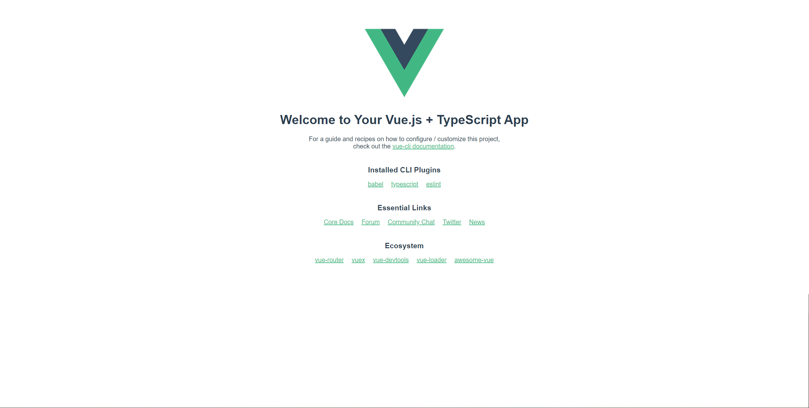
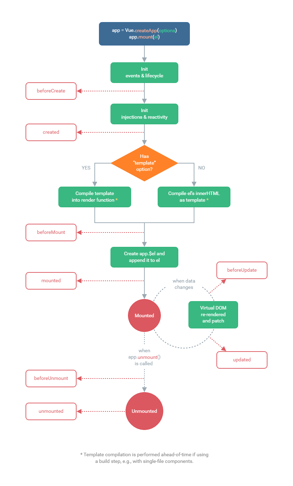
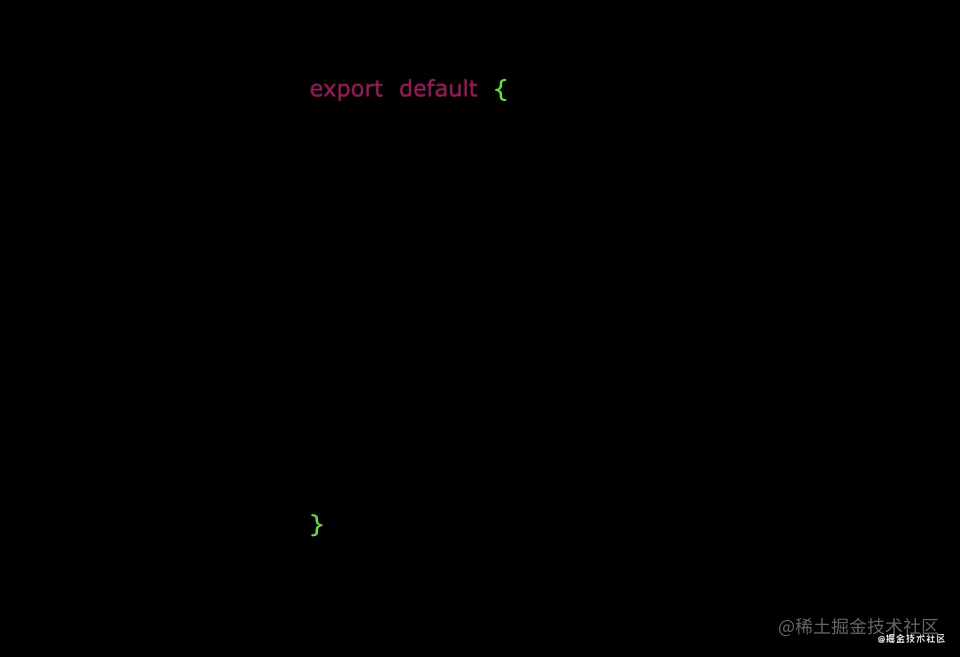
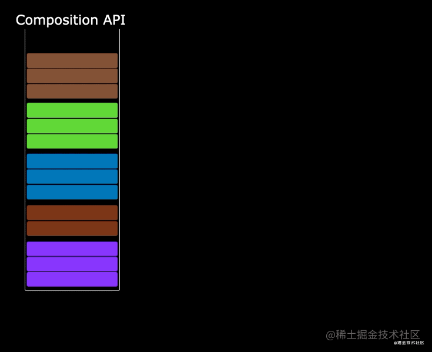
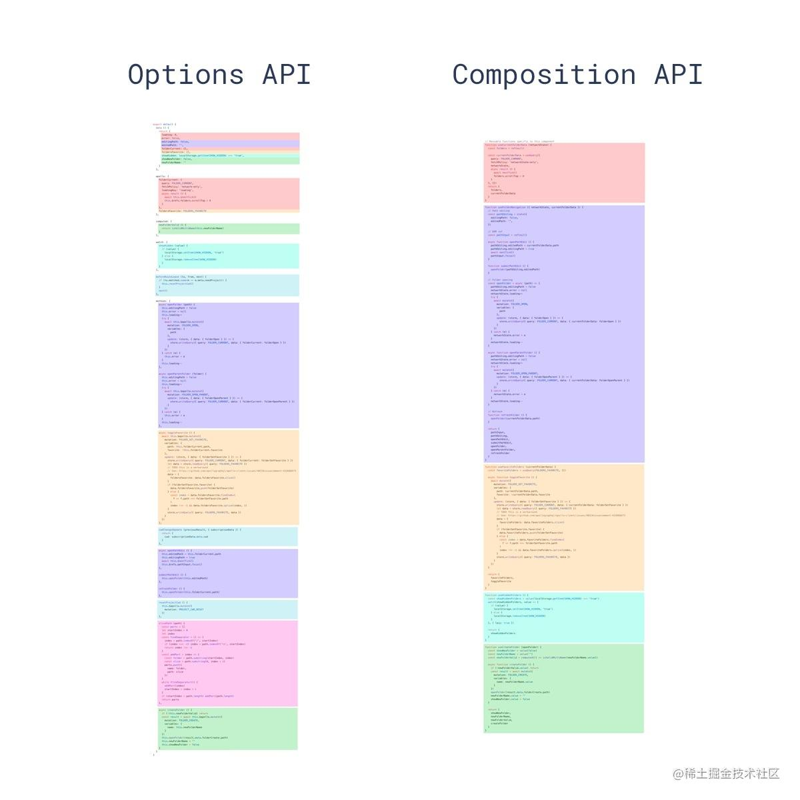
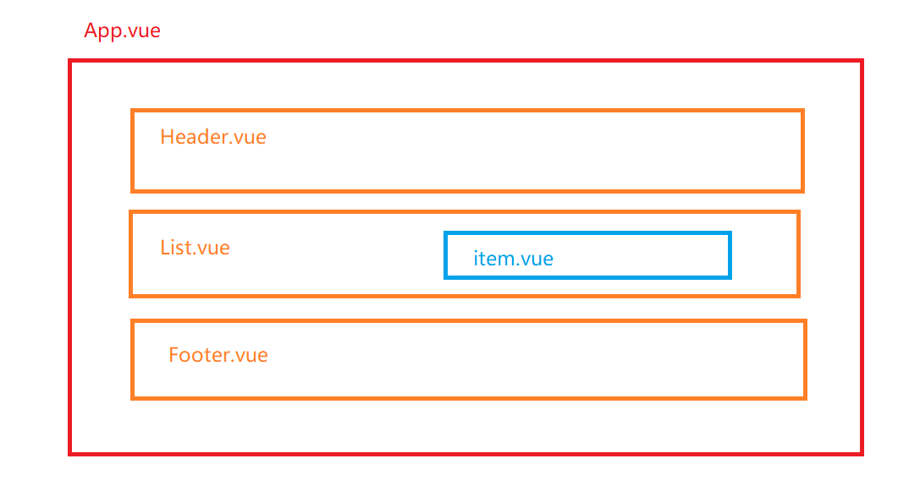

:::info
注意：vue3版本更新较快，这个笔记可能并不完全适合您当前使用的版本
:::

# 1. 认识Vue3

## 1.1 了解相关信息

- Vue.js 3.0 "One Piece" 正式版在2020年9月份发布
- 2年多开发, 100+位贡献者, 2600+次提交, 600+次PR
- **Vue3支持vue2的大多数特性**
- **更好的支持Typescript**

## 1.2 性能提升

- 打包大小减少41%
- 初次渲染快55%, 更新渲染快133%
- 内存减少54%
- **使用Proxy代替defineProperty实现数据响应式**
- **重写虚拟DOM的实现和Tree-Shaking**

## 1.3 新增特性

- **Composition (组合) API**
- setup
  - ref 和 reactive
  - computed 和 watch
  - 新的生命周期函数
  - provide与inject
  - ...
- 新组件
  - Fragment - 文档碎片
  - Teleport - 瞬移组件的位置
  - Suspense - 异步加载组件的loading界面
- 其它API更新
  - 全局API的修改
  - 将原来的全局API转移到应用对象
  - 模板语法变化

# 2. 创建vue3项目

## 2.1 使用 vue-cli 创建（主要以脚手架创建vue3项目）

文档: <https://cli.vuejs.org/zh/guide/creating-a-project.html#vue-create>

```bash
## 安装或者升级
npm install -g @vue/cli
## 保证 vue cli 版本在 4.5.0 以上
vue --version
## 创建项目
vue create my-project
```

如果之前有预设配置，请选择这一个选项：  Manually select features （如果没有这个则跳过进入下一步）

然后的步骤

- Please pick a preset - 选择 ***Manually select features***
- Check the features needed for your project - 选择上 ***TypeScript*** ，特别注意点空格是选择，点回车是下一步
- Choose a version of Vue.js that you want to start the project with - 选择 ***3.x (Preview)***
- Use class-style component syntax - 直接回车
- Use Babel alongside TypeScript - 直接回车
- Pick a linter / formatter config - 直接回车
- Use history mode for router? - 直接回车
- Pick a linter / formatter config - 直接回车
- Pick additional lint features - 直接回车
- Where do you prefer placing config for Babel, ESLint, etc.? - 直接回车
- Save this as a preset for future projects? - 直接回车

## 2.2 使用 vite 创建

- 文档: <https://v3.cn.vuejs.org/guide/installation.html>
- vite 是一个由原生 ESM 驱动的 Web 开发构建工具。在开发环境下基于浏览器原生 ES imports 开发，
- 它做到了***本地快速开发启动***, 在生产环境下基于 Rollup 打包。
  - 快速的冷启动，不需要等待打包操作；
  - 即时的热模块更新，替换性能和模块数量的解耦让更新飞起；
  - 真正的按需编译，不再等待整个应用编译完成，这是一个巨大的改变。

```bash
npm init vite-app <project-name>
cd <project-name>
npm install
npm run dev
```

一般来说有两个版本：

直接JavaScript版本，运行后，浏览器打开的的页面如下：


也有Vue.js + TypeScript App



# 3. Composition API(常用部分)

文档:

 <https://composition-api.vuejs.org/zh/api.html>

## 3.1  setup

- 新的option, 所有的组合API函数都在此使用, 只在初始化时执行一次
- 函数如果返回对象, 对象中的属性或方法, 模板中可以直接使用

## 3.2 ref

- 作用: 定义一个数据的响应式
- 语法: const xxx = ref(initValue):
  - 创建一个包含响应式数据的引用(reference)对象
  - js中操作数据: xxx.value
  - 模板中操作数据: 不需要.value
- 一般用来定义一个基本类型的响应式数据

```vue
<template>
  <h2>{{count}}</h2>
  <hr>
  <button @click="update">更新</button>
</template>

<script>
import {
  ref
} from 'vue'
export default {

  /* 在Vue3中依然可以使用data和methods配置, 但建议使用其新语法实现 */
  // data () {
  //   return {
  //     count: 0
  //   }
  // },
  // methods: {
  //   update () {
  //     this.count++
  //   }
  // }

  /* 使用vue3的composition API */
  setup () {

    // 定义响应式数据 ref对象
    const count = ref(1)    //初始值为1
    console.log(count)

    // 更新响应式数据的函数
    function update () {
      // alert('update')
      count.value = count.value + 1
    }

    return {
      count,
      update
    }
  }
}
</script>
```

TS版本（些许区别）

```vue
<template>
  <div>vue for TS</div>
  <h1>set up 和 ref 的基本使用</h1>
  <h3>{{count}}</h3>
  <button @click="updataCount">数据更新</button>

</template>

<script lang="ts">

import { defineComponent, ref } from 'vue';

export default defineComponent({
  name: 'App',
  //需求：页面打开后可以直接看到一个数据，点击按钮后，该数据发生变化
  //vue2
  // data(){
  //   return {
  //     count : 0
  //   }
  // },
  // methods:{
  //   updataCount(){
  //     this.count++
  //   },
  // },

  //vue3
  setup(){
    //变量
    let count = ref(0)
    //ref是一个对象，作用：定义一个响应式的数据，返回值是一个Ref对象，对象中有一个value属性，如果需要对数据进行操作，需要对该Ref对象调用value属性的方式进行数据操作，count的类型是Ref类型
    // html中的模板中不需要.value的属性的写法
    //方法
    function updataCount(){
      console.log('========')
      // count++  报错，因为是一个对象，对象不能进行++操作
      count.value++
    }

    //返回一个对象
    return {
      count,        //属性
      updataCount,    //方法
    }
  }

});
</script>
```

## 3.3 reactive

- 作用: 定义多个数据的响应式
- const proxy = reactive(obj): 接收一个普通对象然后返回该普通对象的响应式代理器对象
- 响应式转换是“深层的”：会影响对象内部所有嵌套的属性
- 内部基于 ES6 的 Proxy 实现，通过代理对象操作源对象内部数据都是响应式的

```vue
<template>
  <h2>name: {{state.name}}</h2>
  <h2>age: {{state.age}}</h2>
  <h2>wife: {{state.wife}}</h2>
  <hr>
  <button @click="update">更新</button>
</template>

<script>
/* 
reactive: 
    作用: 定义多个数据的响应式
    const proxy = reactive(obj): 接收一个普通对象然后返回该普通对象的响应式代理器对象
    响应式转换是“深层的”：会影响对象内部所有嵌套的属性
    内部基于 ES6 的 Proxy 实现，通过代理对象操作源对象内部数据都是响应式的
*/
import {
  reactive,
} from 'vue'
export default {
  setup () {
    /* 
    定义响应式数据对象
    */
    const state = reactive({
      name: 'tom',
      age: 25,
      wife: {
        name: 'marry',
        age: 22
      },
    })
    console.log(state, state.wife)

    const update = () => {
      state.name += '--'
      state.age += 1
      state.wife.name += '++'
      state.wife.age += 2
    }

    return {
      state,
      update,
    }
  }
}
</script>
```

TS版本（些许区别）

```vue
<template>
  <h1>vue for TS</h1>
  <h2>reactive的应用</h2>
  <h3>名字:{{user.name}}</h3>
  <h3>年龄:{{user.age}}</h3>
  <h3>性别:{{user.gender}}</h3>
  <h3>CV：{{user.other.CV}}</h3>
  <button @click="updataUser">更新数据</button>


</template>

<script lang="ts">

import { defineComponent, reactive } from 'vue';

export default defineComponent({
  name: 'App',
  //需求：显示用户的相关信息，点击按钮，可以更新用户的相关信息数据

  //vue3
  /**
   * - 作用: 定义多个数据的响应式
   * - const proxy = reactive(obj): 接收一个普通对象然后返回该普通对象的响应式代理器对象
   * - 响应式转换是“深层的”：会影响对象内部所有嵌套的属性
   * - 内部基于 ES6 的 Proxy 实现，通过代理对象操作源对象内部数据都是响应式的
   */
  setup(){

    const obj: any = {
      //obj对象
      name:'barbatos',
      age:3000,
      // gender:'男 ',
      other:{
        name:'Venti',
        nickname:'卖唱的',
        CV:['喵☆酱【中】','村濑步【日】'],
      }
    }

    //把数据变成相应式
    //返回的是一个Proxy(代理)对象，被代理者式obj对象
    //user 现在是代理对象，类型是Proxy(代理)类型，obj是目标对象
    const user = reactive(obj)
    console.log(user)

    //方法
    const updataUser = ()=>{
      user.name = '温迪'
      // obj.name = '卖唱的'
      // 直接使用目标对象的方式更新目标对象中的成员的值。是不可能的，只能使用代理对象的方式来更新数据

      //user对象或者obj对象添加一个新属性，哪一种方法会影响界面的更新?
      //obj.gender = '女'  //在老一些的版本中，页面没有更新，但是在新版本中，这个页面也可以更新了
      user.gender = '男'   //如果要更新数据，推荐使用本方法，页面更新渲染，且也添加到了obj对象上

      // delete obj.age
      //delete user.age   //删除对象效果，同上
      console.log(user)

      user.other.CV[2]= '艾丽卡·哈拉彻【英】'

    }

    /**
     * 总结：推荐使用：
     * const user = reactive({
     *       //obj对象
     *       name:'barbatos',
     *       age:3000,
     *       other:{
     *         name:'Venti',
     *         nickname:'卖唱的',
     *         CV:['喵☆酱','村濑步'],
     *       }
     *     })
     *
     *     添加和删除，都直接使用
     *     user.xxx属性名 = xxx
     *     delete user.属性名
     *
     */


    return{
      user,
      updataUser
    }
  }

});
</script>

```

## 3.4 比较Vue2与Vue3的响应式(重要)

## 3.4.1 vue2的响应式

- 核心:
  - 对象: 通过defineProperty对对象的已有属性值的读取和修改进行劫持(监视/拦截)
  - 数组: 通过重写数组更新数组一系列更新元素的方法来实现元素修改的劫持

```js
Object.defineProperty(data, 'count', {
    get () {}, 
    set () {}
})
```

- 问题
  - 对象直接新添加的属性或删除已有属性, 界面不会自动更新
  - 直接通过下标替换元素或更新length, 界面不会自动更新 arr[1] = {}

## 3.4.2 Vue3的响应式

- 核心:
  - 通过Proxy(代理): 拦截对data任意属性的任意(13种)操作, 包括属性值的读写, 属性的添加, 属性的删除等...
  - 通过 Reflect(反射): 动态对被代理对象的相应属性进行特定的操作
  - 文档:
    - <https://developer.mozilla.org/zh-CN/docs/Web/JavaScript/Reference/Global_Objects/Proxy>
    - <https://developer.mozilla.org/zh-CN/docs/Web/JavaScript/Reference/Global_Objects/Reflect>

```js
new Proxy(data, {
 // 拦截读取属性值
    get (target, prop) {
     return Reflect.get(target, prop)
    },
    // 拦截设置属性值或添加新属性
    set (target, prop, value) {
     return Reflect.set(target, prop, value)
    },
    // 拦截删除属性
    deleteProperty (target, prop) {
     return Reflect.deleteProperty(target, prop)
    }
})

proxy.name = 'tom' 
```

```html
<!DOCTYPE html>
<html lang="en">
<head>
  <meta charset="UTF-8">
  <meta name="viewport" content="width=device-width, initial-scale=1.0">
  <title>Proxy 与 Reflect</title>
</head>
<body>
  <script>
    
    //目标对象
    const user = {
      name: "beelzebul",
      age: 4000,
      friends:{
          name:'YaeMiko'
          age:500
      }
    };

    /* 
    proxyUser是代理对象, user是被代理对象
    后面所有的操作都是通过代理对象来操作被代理对象内部属性
    
    参数1：user--->target目标对象
    参数2：handler--->处理器对象，用来监视数据，以及数据的操作
    */
    const proxyUser = new Proxy(user, {
  //获取目标对象的某个属性
      get(target, prop) {
        console.log('劫持get()', prop)
        return Reflect.get(target, prop)
      },
  //修改或者删除目标对象的某个属性
      set(target, prop, val) {
        console.log('劫持set()', prop, val)
        return Reflect.set(target, prop, val); // (2)
      },
        //删除目标对象的某个属性
      deleteProperty (target, prop) {
        console.log('劫持delete属性', prop)
        return Reflect.deleteProperty(target, prop)
      }
    });
      
    // 通过代理对象获取对象中的某个属性值
    // 通过代理对象读取属性值 用到get()
    console.log(proxyUser===user)
    console.log(proxyUser.name, proxyUser.age)   //beelzebul 4000
      
    // 通过代理对象设置属性值 用到set()
    proxyUser.name = '雷电影'
    proxyUser.age = 4000
    console.log(user)
      
    // 通过代理对象添加属性  用到set()
    proxyUser.sex = '女'
    console.log(user)
      
    // 通过代理对象删除属性   用到deleteProperty()
    delete proxyUser.sex
    console.log(user)
      
    //更新目标对象中的某个属性对象中的属性值  用到set()
    proxyUser.friends.name = '八重神子'
    console.log(user)
  </script>
</body>
</html>
```

## 3.5 setup细节

- setup执行的时机
  - **在beforeCreate之前执行(一次), 此时组件对象还没有创建**
  - this是undefined, 不能通过this来访问data/computed/methods / props
  - 其实所有的composition API相关回调函数中也都不可以
- setup的返回值
  - 一般都返回一个对象: 为模板提供数据, 也就是模板中可以直接使用此对象中的所有属性/方法
  - **返回对象中的属性会与data函数返回对象的属性合并成为组件对象的属性**
  - **返回对象中的方法会与methods中的方法合并成功组件对象的方法**
  - **如果有重名, setup优先**
  - 注意:
  - 在vue3中一般不要混合使用: methods中可以访问setup提供的属性和方法, 但在setup方法中不能访问data和methods
  - **setup不能是一个async函数: 因为返回值不再是return的对象, 而是promise**, 模板看不到return对象中的属性数据
- setup的参数
  - setup(props, context) / setup(props, {attrs, slots, emit})
  - props: 包含props配置声明且传入了的所有属性的对象
  - attrs: 包含没有在props配置中声明的属性的对象, 相当于 this.$attrs
  - slots: 包含所有传入的插槽内容的对象, 相当于 this.$slots
  - emit: 用来分发自定义事件的函数, 相当于 this.$emit

父级组件： App.vue

```vue
<template>
  <h2>App</h2>
  <p>msg: {{msg}}</p>
  <button @click="fn('--')">更新</button>

  <child :msg="msg" msg2="真香" @fn="fn"/>   
      <!--
								注意：这里的 @fn="fn" 是自定义事件
									 最新的vue版本各有各的要求，在我所使用的版本
								@fn和fn 必须一致，否者无法通过emit()分发事件和传参
						-->
</template>

<script lang="ts">
import {
  reactive,
  ref,
} from 'vue'
import child from './child.vue'

export default {

  components: {
    child
  },

  setup () {
    const msg = ref('abc')

    function fn (content: string) {
      msg.value += content            //这里的content 会薛定谔的 undefined
    }
    return {
      msg,
      fn
    }
  }
}
</script>
```

子级组件：Child.vue

```vue
<template>
  <div>
    <h3>{{n}}</h3>
    <h3>{{m}}</h3>

    <h3>msg: {{msg}}</h3>
    <h3>msg2: {{$attrs.msg2}}</h3>

    <slot name="xxx"></slot>

    <button @click="update">更新</button>
  </div>
</template>

<script lang="ts">

import {
  ref,
  defineComponent
} from 'vue'

export default defineComponent({
  name: 'child',

  props: ['msg'],   //用于传递从父级组件传来的msg参数数据

  emits: ['fn'], // 可选的, 声明了更利于程序员阅读, 且可以对分发的事件数据进行校验

  data () {
    console.log('data', this)
    return {
      // n: 1
    }
  },
    
    //setup是在beforeCreate生命周期回调之前就已经执行了一次
    //由此可知，setup执行的时候，当前组件还没创建出来，也就意味着：组件实例对象的this不可用

  //数据初始化的声明回调
  beforeCreate () {
    console.log('beforeCreate', this)     //beforeCreate undefined
              //this是undefined, 不能通过this来访问data/computed/methods/props
  },

  methods: {
    // update () {
    //   this.n++
    //   this.m++
    // }
  },

  // setup (props, context) {
  setup (props, {attrs, emit, slots}) {
      
      //props参数，是一个对象，里面有父级组件向子级组件传递的数据，并且是在子级组件中使用props接收到的所有属性
      console.log(props.msg)    //abc
      
      //context，一个对象，包含attrs对象（获取当前组件标签上的的所有属性，但是该属性是没有在props配置中声明的属性的对象）, emit对象（分发事件的）, slots对象（插槽）
          
      //attrs
      console.log(attrs.msg2)   //真香
      
      //emit
           
      //slots
     

    console.log('setup', this)
    console.log(props.msg, attrs.msg2, slots, emit)

    const m = ref(2)
    const n = ref(3)

    function update () {
      // console.log('--', this)
      // this.n += 2 
      // this.m += 2

      m.value += 2
      n.value += 2

      // 分发自定义事件
      emit('fn', '++')
    }

    return {
        //setup一般返回的都是对象，内部的属性和方法，html模板都可以直接使用
      m,
      n,
      update,
    }
  },
    
    //界面渲染后的生命周期回调
//    mounted(){
//        console.log(this)
//    }
})
</script>
```

setup中的emit()的要注意的地方：

注意：在父级的组件中，这里的 @fn="fn" 是自定义事件，最新的vue版本各有各的要求，在我所使用的版本，@fn和fn 必须一致，否者无法通过emit()分发事件和传参。

参考资料：<https://www.jianshu.com/p/3757745039e4>

父级组件

```vue
<template>
  <h1>vue for TS</h1>
  <h2>App父级组件</h2>
  <h3>{{msg}}</h3>
  <button @click="updataMsg('==')">更新数据</button>
  <hr>
  <Child :msg="msg" :msg2="msg2" @fn="fn"/>


</template>

<script lang="ts">

import {defineComponent, reactive, ref} from 'vue';
import Child from './components/Child.vue';

export default defineComponent({
  name: 'App',

  setup(){
    let msg = ref('你帮我做森林书任务，我们就是好朋友')
    let msg2 = ref('真香')
    function updataMsg(content:string){
      msg.value += content
    }

    function fn (item:string) {
      console.log('字组件传来的的数据', item)
      msg.value += item
    }
    return{
      msg,
      msg2,
      updataMsg,
      fn,
    }
  },

  //注册组件
  components:{
    Child,

  }

});
</script>
```

子级组件

```vue
<template>
  <h2>App子级组件</h2>
  <h3>{{msg}}</h3>
  <h4>{{count}}</h4>
  <button @click="myemit">分发事件</button>
</template>

<script lang="ts">
export default {
  name: "Child",
  props: ['msg'],
  setup(props:any,{attrs, emit}:any){
    console.log(props.msg)
    console.log(attrs.msg2)


    //按钮的点击事件的回调函数
    function myemit() {
      console.log('emit')
      emit('fn','     你妈的快给爷传参')
    }

    return{
      myemit
    }

  },


}
</script>

<style scoped>

</style>
```

## 3.6 reactive与ref-细节

- 是Vue3的 composition API中2个最重要的响应式API
- ref用来处理基本类型数据, reactive用来处理对象(递归深度响应式)
- 如果用ref对象/数组, 内部会自动将对象/数组转换为reactive的代理对象
- ref内部: 通过给value属性添加getter/setter来实现对数据的劫持
- reactive内部: 通过使用Proxy来实现对对象内部所有数据的劫持, 并通过Reflect操作对象内部数据
- ref的数据操作: 在js中要.value, 在模板中不需要(内部解析模板时会自动添加.value)

```vue
<template>
  <h2>App</h2>
  <p>m1: {{m1}}</p>
  <p>m2: {{m2}}</p>
  <p>m3: {{m3}}</p>
  <button @click="update">更新</button>
</template>

<script lang="ts">
import {
  reactive,
  ref
} from 'vue'

export default {

  setup () {
    const m1 = ref('abc')
    const m2 = reactive({x: 1, y: {z: 'abc'}})

    // 使用ref处理对象  ==> 对象会被自动reactive为proxy对象
    const m3 = ref({a1: 2, a2: {a3: 'abc'}})
    console.log(m1, m2, m3)
    console.log(m3.value.a2) // 也是一个proxy对象

    function update() {
      m1.value += '--'
      m2.x += 1
      m2.y.z += '++'

      m3.value = {a1: 3, a2: {a3: 'abc---'}}
      m3.value.a2.a3 += '==' // reactive对对象进行了深度数据劫持
      console.log(m3.value.a2)
    }

    return {
      m1,
      m2,
      m3,
      update
    }
  }
}
</script>
```

## 3.7  计算属性与监视

- computed函数:

  - 与computed配置功能一致
  - 只有getter
  - 有getter和setter

- watch函数

  - 与watch配置功能一致
  - 监视指定的一个或多个响应式数据, 一旦数据变化, 就自动执行监视回调
  - 默认初始时不执行回调, 但可以通过配置immediate为true, 来指定初始时立即执行第一次
  - 通过配置deep为true, 来指定深度监视

- watchEffect函数

  - 不用直接指定要监视的数据, 回调函数中使用的哪些响应式数据就监视哪些响应式数据
  - 默认初始时就会执行第一次, 从而可以收集需要监视的数据
  - 监视数据发生变化时回调

  较新版本的vue3

```vue
<template>
  <h1>vue for TS</h1>
  <h2>计算属性和监视</h2>
  <fieldset>
    <legend>姓名操作</legend>
    姓氏：<input type="text" placeholder="请输入姓氏" v-model="user.fistName">
    名字：<input type="text" placeholder="请输入名字" v-model="user.lastName">
  </fieldset>
  <fieldset>
    <legend>计算属性和监视的演示</legend>
    姓名：<input type="text" placeholder="显示姓名" v-model="fullName1">
    姓名：<input type="text" placeholder="显示姓名" v-model="fullName2">
    姓名：<input type="text" placeholder="显示姓名" v-model="fullName3">
  </fieldset>

</template>

<script lang="ts">

import {computed, defineComponent, ref, watch, watchEffect} from 'vue';


export default defineComponent({
  name: 'App',

  setup(){
    const user = ref({
      fistName:'东方',
      lastName:'不败'
    })

    //通过计算属性的方式，实现第一个姓名的显示
    //vue3 中的计算属性
    // 计算属性的函数中如果传入一个回调函数，表示的是get

    //第一个姓名
    //返回的是一个Ref类型的对象
    const fullName1 = computed(()=>{
      return user.value.fistName + '_' + user.value.lastName
    })

    //第二个姓名
    const fullName2 = computed({
      get(){
        return user.value.fistName + '_' + user.value.lastName
      },
      set(val:string){
        const names = val.split('_')
        user.value.fistName = names[0]
        user.value.lastName = names[1]

      }
    })

    //第三个姓名
    const fullName3 = ref()

    //监视---监视指定的数据
    watch(user,({fistName,lastName})=>{
        fullName3.value = fistName + '_' + lastName
    },{immediate:true,deep:true})
    //immediate 默认会执行一次watch，deep深度监视

    //监视  watchEffect,不需要配置immediate，本身默认进行监视（默认先执行一次）
    // watchEffect(()=>{
    //   fullName3.value = user.value.fistName + '_' + user.value.lastName
    // })

    //监视fullName3的数据，改变fistName和lastName
    watchEffect(()=>{
      const names = fullName3.value.split('_')
      user.value.fistName = names[0]
      user.value.lastName = names[1]
    })

    //watch----可以监视多个数据
    //在vue3早期版本中，这里的代码不会执行。因为数组内的参数都必须是响应式的数据，
    // 而user.value.fistName、user.value.lastName不是相应式的数据，fullName是响应式的数据

    //在比较新的版本中会出现警告。原因如上
    // watch([user.value.fistName,user.value.lastName,fullName3],()=>{
    //   console.log('watch----可以监视多个数据')
    // })

    //所以通过回调的写法，将user.value.fistName,user.value.lastName转为响应式的数据
    //()=>user.value.fistName,()=>user.value.lastName  是响应式的数据
    watch([()=>user.value.fistName,()=>user.value.lastName,fullName3],()=>{
      console.log('watch----可以监视多个数据')
    })


    return{
      user,
      fullName1,
      fullName2,
      fullName3
    }
  },

  //注册组件
  components:{


  }

});
</script>
```

## 3.8 生命周期

**vue2.x的生命周期**


**vue3的生命周期**



**与 2.x 版本生命周期相对应的组合式 API**

- `beforeCreate` -> 使用 `setup()`
- `created` -> 使用 `setup()`
- `beforeMount` -> `onBeforeMount`
- `mounted` -> `onMounted`
- `beforeUpdate` -> `onBeforeUpdate`
- `updated` -> `onUpdated`
- `beforeDestroy` -> `onBeforeUnmount`
- `destroyed` -> `onUnmounted`
- `errorCaptured` -> `onErrorCaptured`

**新增的钩子函数**

组合式 API 还提供了以下调试钩子函数：

- onRenderTracked
- onRenderTriggered

子组件

```vue
<template>
<h2>Child 子级组件</h2>
  <h3>{{msg}}</h3>
  <button @click="update">点击更新</button>
</template>

<script>
import {
  ref,
  onMounted,
  onUpdated,
  onUnmounted,
  onBeforeMount,
  onBeforeUpdate,
  onBeforeUnmount
} from "vue";

export default {
  name: "Child",

  //vue2.x 中的生命钩子
  beforeCreate(){
    console.log('vue2.x 中的 beforeCreate')
  },
  created() {
    console.log('vue2.x 中的 created')
  },
  beforeMount() {
    console.log('vue2.x 中的 beforeMount')
  },
  mounted() {
    console.log('vue2.x 中的 mounted')
  },
  beforeUpdate() {
    console.log('vue2.x 中的 beforeCreate')
  },
  updated() {
    console.log('vue2.x 中的 updated')
  },
  //beforeDestroy,destroyed在vue3中改名了
  
  beforeUnmount() {
    console.log('vue2.x 中的 beforeDestroy')
  },
  unmounted() {
    console.log('vue2.x 中的 destroyed')
  },


  setup() {

    const msg = ref('abc')

    const update = () => {
      msg.value += '--'
    }

    onBeforeMount(() => {
      console.log('vue3.x--onBeforeMount')
    })

    onMounted(() => {
      console.log('vue3.x--onMounted')
    })

    onBeforeUpdate(() => {
      console.log('vue3.x--onBeforeUpdate')
    })

    onUpdated(() => {
      console.log('vue3.x--onUpdated')
    })

    onBeforeUnmount(() => {
      console.log('vue3.x--onBeforeUnmount')
    })

    onUnmounted(() => {
      console.log('vue3.x--onUnmounted')
    })

    return {
      msg,
      update
    }
  }
}

</script>

```

父组件

```vue
<template>
  <h2>App</h2>
  <button @click="isShow=!isShow">切换</button>
  <hr>
  <Child v-if="isShow"/>
</template>

<script lang="ts">
import Child from './Child.vue'
export default {

  data () {
    return {
      isShow: true
    }
  },

  components: {
    Child
  }
}
</script>
```

## 3.9 自定义hook函数

- 使用Vue3的组合API封装的可复用的功能函数

- 自定义hook的作用类似于vue2中的mixin技术

- 自定义Hook的优势: 很清楚复用功能代码的来源, 更清楚易懂

- 需求1: 收集用户鼠标点击的页面坐标

  hooks/useMousePosition.ts

```js
import { ref, onMounted, onUnmounted } from 'vue'
/* 
收集用户鼠标点击的页面坐标
*/
export default function useMousePosition () {
  // 初始化坐标数据
  const x = ref(-1)
  const y = ref(-1)

  // 用于收集点击事件坐标的函数
  const updatePosition = (e: MouseEvent) => {
    x.value = e.pageX
    y.value = e.pageY
  }

  // 挂载后绑定点击监听
  onMounted(() => {
    document.addEventListener('click', updatePosition)
  })

  // 卸载前解绑点击监听
  onUnmounted(() => {
    document.removeEventListener('click', updatePosition)
  })

  return {x, y}
}
```

```vue
<template>
<div>
  <h2>x: {{x}}, y: {{y}}</h2>
</div>
</template>

<script>

import {
  ref
} from "vue"
/* 
在组件中引入并使用自定义hook
自定义hook的作用类似于vue2中的mixin技术
自定义Hook的优势: 很清楚复用功能代码的来源, 更清楚易懂
*/
import useMousePosition from './hooks/useMousePosition'

export default {
  setup() {

    const {x, y} = useMousePosition()

    return {
      x,
      y,
    }
  }
}
</script>
```

- 利用TS泛型强化类型检查

- 需求2: 封装发ajax请求的hook函数

  hooks/useRequest.ts

```ts
import { ref } from 'vue'
import axios from 'axios'

/* 
使用axios发送异步ajax请求
*/
export default function useUrlLoader<T>(url: string) {

  const result = ref<T | null>(null)
  const loading = ref(true)
  const errorMsg = ref(null)

  axios.get(url)
    .then(response => {
      loading.value = false
      result.value = response.data
    })
    .catch(e => {
      loading.value = false
      errorMsg.value = e.message || '未知错误'
    })

  return {
    loading,
    result,
    errorMsg,
  }
}
```

```vue
<template>
<div class="about">
  <h2 v-if="loading">LOADING...</h2>
  <h2 v-else-if="errorMsg">{{errorMsg}}</h2>
  <!-- <ul v-else>
    <li>id: {{result.id}}</li>
    <li>name: {{result.name}}</li>
    <li>distance: {{result.distance}}</li>
  </ul> -->

  <ul v-for="p in result" :key="p.id">
    <li>id: {{p.id}}</li>
    <li>title: {{p.title}}</li>
    <li>price: {{p.price}}</li>
  </ul>
  <!--  -->
</div>
</template>

<script lang="ts">
import {
  watch
} from "vue"
import useRequest from './hooks/useRequest'

// 地址数据接口
interface AddressResult {
  id: number;
  name: string;
  distance: string;
}

// 产品数据接口
interface ProductResult {
  id: string;
  title: string;
  price: number;
}

export default {
  setup() {

    // const {loading, result, errorMsg} = useRequest<AddressResult>('/data/address.json')
    const {loading, result, errorMsg} = useRequest<ProductResult[]>('/data/products.json')

    watch(result, () => {
      if (result.value) {
        console.log(result.value.length) // 有提示
      }
    })

    return {
      loading,
      result, 
      errorMsg
    }
  }
}
</script>
```

## 3.10 toRefs

**把一个响应式对象转换成普通对象**，该普通对象的每个 property 都是一个 ref

应用: 当从合成函数返回响应式对象时，toRefs 非常有用，这样消费组件就可以在不丢失响应式的情况下对返回的对象进行分解使用

问题: reactive 对象取出的所有属性值都是非响应式的

解决: 利用 toRefs 可以将一个响应式 reactive 对象的所有原始属性转换为响应式的 ref 属性

```vue
<template>
  <h2>App</h2>
  <h3>foo: {{foo}}</h3>
  <h3>bar: {{bar}}</h3>
  <h3>foo2: {{foo2}}</h3>
  <h3>bar2: {{bar2}}</h3>


</template>

<script lang="ts">
import { reactive, toRefs } from 'vue'
/*
toRefs:
  将响应式对象中所有属性包装为ref对象, 并返回包含这些ref对象的普通对象
  应用: 当从合成函数返回响应式对象时，toRefs 非常有用，
        这样消费组件就可以在不丢失响应式的情况下对返回的对象进行分解使用
*/
export default {

  setup () {

    const state = reactive({
      foo: 'a',
      bar: 'b',
    })

    const stateAsRefs = toRefs(state)

    setTimeout(() => {
      state.foo += '++'
      state.bar += '++'
    }, 2000);

    const {foo2, bar2} = useReatureX()

    return {
      // ...state,
      ...stateAsRefs,
      foo2, 
      bar2
    }
  },
}
```

```vue
function useReatureX() {
  const state = reactive({
    foo2: 'a',
    bar2: 'b',
  })

  setTimeout(() => {
    state.foo2 += '++'
    state.bar2 += '++'
  }, 2000);

  return toRefs(state)
}

</script>
```

看的乱，没关系，看这个

```vue
<template>
  <h1>vue for TS</h1>
  <h2>toRefs的使用</h2>
<!--  <h3>name：{{state.name}}</h3>-->
<!--  <h3>age：{{state.age}}</h3>-->
<!--  state是响应式数值，结构出来的name不会发生变化
  <h3>name：{{name}}</h3>
  <h3>age：{{age}}</h3>
  -->
  <h3>name：{{name}}</h3>
  <h3>age：{{age}}</h3>


  <h3>name2：{{name2}}</h3>
  <h3>age2：{{age2}}</h3>

</template>

<script lang="ts">

import {defineComponent, reactive, toRefs} from 'vue';


export default defineComponent({
  name: 'App',

  setup(){
    const state = reactive({
      name:'Nahida',
      age:500
    });

    // setInterval(()=>{
    //   state.name += '2233'
    //   console.log('11')
    // },5000)

    //================================================================

    //利用 toRefs 可以将一个响应式 reactive 对象的所有原始属性转换为响应式的 ref 属性
    const state2 = toRefs(state)    //state2是原始属性
    const {name,age} =state2
    setInterval(()=>{
      name.value += '2233'        //原始属性对象成员为ref属性，这里需要用
      console.log('11')
    },10000)


    //===================使用场景：自定义一个hook函数====================
    function useReatureX() {
      const state = reactive({
        name2: 'Morax',
        age2: '5000',
      })
      setInterval(()=>{
        state.name2 +='没钱'
      },3000)
      return toRefs(state)
    }
    const {name2,age2} = useReatureX()


    return{
      //ref对象
      state,
      //...state 结构赋值，因为state是响应数值，模板文件中的 name、age没有变化
      //

      //ref对象转为原始属性后：（使用toRefs）
      name,
      age,

      //自定义hook
      name2,
      age2

    }

  },

  //注册组件
  components:{
  }

});
</script>
```

## 3.11 ref获取元素

利用ref函数获取组件中的标签元素

功能需求: 让输入框自动获取焦点

```vue
<template>
  <h2>App</h2>
  <input type="text">---
  <input type="text" ref="inputRef">
</template>

<script lang="ts">
import { onMounted, ref } from 'vue'
/* 
ref获取元素: 利用ref函数获取组件中的标签元素
功能需求: 让输入框自动获取焦点
*/
export default {
  setup() {
    const inputRef = ref<HTMLElement|null>(null)   //默认对象为空
 
    ////页面加载完毕后：组合标签onMounted 生命周期钩子
    onMounted(() => {
      inputRef.value && inputRef.value.focus()   
        //如果inputRef.value为假，不进行inputRef.value.focus()操作
        //如果inputRef.value不真，进行inputRef.value.focus()操作
    })

    return {
      inputRef
    }
  },
}
</script>
```

# 4 Composition API(其它部分)

## 4.1  shallowReactive 与 shallowRef

shallow：浅

- shallowReactive : **只处理了对象内最外层属性**的响应式(也就是浅响应式)
- shallowRef: **只处理了value的响应式**, 不进行对象的reactive处理
- 什么时候用浅响应式呢?
  - 一般情况下使用ref和reactive即可
  - 如果有一个对象数据, 结构比较深, 但变化时只是外层属性变化 ===> shallowReactive
  - 如果有一个对象数据, 后面会产生新的对象来替换 ===> shallowRef

```vue
<template>
  <h2>App</h2>

  <h3>m1: {{m1}}</h3>
  <h3>m2: {{m2}}</h3>
  <h3>m3: {{m3}}</h3>
  <h3>m4: {{m4}}</h3>

  <button @click="update">更新</button>
</template>

<script lang="ts">
import { reactive, ref, shallowReactive, shallowRef } from 'vue'
/* 
shallowReactive与shallowRef
  shallowReactive: 只处理了对象内最外层属性的响应式(也就是浅响应式)
  shallowRef: 只处理了value的响应式, 不进行对象的reactive处理
总结:
  reactive与ref实现的是深度响应式, 而shallowReactive与shallowRef是浅响应式
  什么时候用浅响应式呢?
    一般情况下使用ref和reactive即可,
    如果有一个对象数据, 结构比较深, 但变化时只是外层属性变化 ===> shallowReactive
    如果有一个对象数据, 后面会产生新的对象来替换 ===> shallowRef
*/

export default {

  setup () {

    const m1 = reactive({
        a: 1,
        b: {c: 2}
    })
    
    const m2 = shallowReactive({
        a: 1,
        b: {c: 2}
    })

    const m3 = ref({
        a: 1, 
        b: {c: 2}
    })
    const m4 = shallowRef({
        a: 1,
        b: {c: 2}
    })

    const update = () => {
      //更新m1数据 reactive
      m1.b.c += 1
        
        //更新m2数据 shallowReactive
      m2.a +=1      //触发事件有变化
      m2.b.c += 1   //触发事件后无变化
  
        //更新m3数据 ref
      m3.value.a += 1
        
        ////更新m4数据 shallowRef
      m4.value.a += 1   //触发事件后无变化，m4是对象
            //因为shallowRef: 只处理了value的响应式, 不进行对象的reactive处理
    }

    return {
      m1,
      m2,
      m3,
      m4,
      update,
    }
  }
}
</script>
```

## 4.2 readonly 与 shallowReadonly

- readonly:
  - 深度只读数据
  - 获取一个对象 (响应式或纯对象) 或 ref 并返回原始代理的只读代理。
  - 只读代理是深层的：访问的任何嵌套 property 也是只读的。
- shallowReadonly
  - 浅只读数据
  - 创建一个代理，使其自身的 property 为只读，但不执行嵌套对象的深度只读转换
- 应用场景:
  - 在某些特定情况下, 我们可能不希望对数据进行更新的操作, 那就可以包装生成一个只读代理对象来读取数据, 而不能修改或删除

```vue
<template>
  <h2>App</h2>
  <h3>{{state}}</h3>
  <button @click="update">更新</button>
</template>

<script lang="ts">
import { reactive, readonly, shallowReadonly } from 'vue'
/*
readonly: 深度只读数据
  获取一个对象 (响应式或纯对象) 或 ref 并返回原始代理的只读代理。
  只读代理是深层的：访问的任何嵌套 property 也是只读的。
shallowReadonly: 浅只读数据
  创建一个代理，使其自身的 property 为只读，但不执行嵌套对象的深度只读转换 
应用场景: 
  在某些特定情况下, 我们可能不希望对数据进行更新的操作, 那就可以包装生成一个只读代理对象来读取数据, 而不能修改或删除
*/

export default {

  setup () {

    const state = reactive({
      a: 1,
      b: {
        c: 2
      }
    })

    // const rState1 = readonly(state)
    const rState2 = shallowReadonly(state)

    const update = () => {
      // rState1.a++ // error
      // rState1.b.c++ // error

      // rState2.a++ // error
      rState2.b.c++
    }
    
    return {
      state,
      update
    }
  }
}
</script>
```

## 4.3 toRaw 与 markRaw

- toRaw
  - 返回由 `reactive` 或 `readonly` 方法**转换成响应式代理的普通对象**。
  - 这是一个还原方法，可用于临时读取，访问不会被代理/跟踪，写入时也不会触发界面更新。
- markRaw
  - 标记一个对象，使其永远不会转换为代理。返回对象本身
  - 应用场景:
    - 有些值不应被设置为响应式的，例如复杂的第三方类实例或 Vue 组件对象。
    - 当渲染具有不可变数据源的大列表时，跳过代理转换可以提高性能。

```vue
<template>
  <h2>{{state}}</h2>
  <button @click="testToRaw">测试toRaw</button>
  <button @click="testMarkRaw">测试markRaw</button>
</template>

<script lang="ts">
/* 
toRaw: 得到reactive代理对象的目标数据对象
*/
import {
  markRaw,
  reactive, toRaw,
} from 'vue'
interface UserInfo{
    name:string;
    age:number;
    likes?:string[];
}
export default {
  setup () {
    const state = reactive<UserInfo>({
      name: 'tom',
      age: 25,
    })

    const testToRaw = () => {
        //把代理对象变成普通对象，数据变化，界面不变化
      const user = toRaw(state)
      user.age++  // 数据有变化，但是界面不会更新

    }

    const testMarkRaw = () => {
      const likes = ['a', 'b']
      // state.likes = likes
      // markRow标记的对象数据，从此不再称为代理对象 
      state.likes = markRaw(likes) // likes数组就不再是响应式的了
      setTimeout(() => {
        state.likes[0] += '--'
      }, 1000)
    }

    return {
      state,
      testToRaw,
      testMarkRaw,
    }
  }
}
</script>
```

## 4.4 toRef

- 为**源响应式对象上的某个属性创建一个 ref对象, 二者内部操作的是同一个数据值, 更新时二者是同步的**
- **区别ref: 拷贝了一份新的数据**值单独操作, 更新时相互不影响
- 应用: 当要将 某个props的 ref 传递给复合函数时，toRef 很有用

```vue
<template>
  <h2>App</h2>
  <p>{{state}}</p>
  <p>{{foo}}</p>
  <p>{{foo2}}</p>

  <button @click="update">更新</button>

  <Child :foo="foo"/>
</template>

<script lang="ts">
/*
toRef:
  为源响应式对象上的某个属性创建一个 ref对象, 二者内部操作的是同一个数据值, 更新时二者是同步的
  区别ref: 拷贝了一份新的数据值单独操作, 更新时相互不影响
  应用: 当要将某个 prop 的 ref 传递给复合函数时，toRef 很有用
*/

import {
  reactive,
  toRef,
  ref,
} from 'vue'
import Child from './Child.vue'

export default {

  setup () {

    const state = reactive({
      foo: 1,
      bar: 2
    })

    const foo = toRef(state, 'foo')
    const foo2 = ref(state.foo)

    const update = () => {
      state.foo++
      // foo.value++
        
      // foo2.value++  // foo和state中的数据不会更新
    }

    return {
      state,
      foo,
      foo2,
      update,
    }
  },

  components: {
    Child
  }
}
</script>
```

```vue
<template>
  <h2>Child</h2>
  <h3>{{foo}}</h3>
  <h3>{{length}}</h3>
</template>

<script lang="ts">
import { computed, defineComponent, Ref, toRef } from 'vue'

const component = defineComponent({
  props: {    //props是从父组件传入的是foo.value的值，因此可见，props是原始属性，不是ref对象
    foo: {
      type: Number,
      require: true  //必须引用
    }
  },

  setup (props, context) {
    const length = useFeatureX(toRef(props, 'foo'))

    return {
      length
    }
  }
})

function useFeatureX(foo: Ref) {
  const lenth = computed(() => foo.value.length)  
    //computed 计算属性，返回一个Ref类型（ref对象响应型的数据）

  return lenth //因此，当foo发生变化时，foo的长度，lenth也会相应变化
}

export default component
</script>
```

## 4.5 customRef

- 创建一个自定义的 ref，并对其依赖项跟踪和更新触发进行显式控制
- 需求: 使用 customRef 实现 debounce 的示例

```vue
<template>
  <h2>App</h2>
  <input v-model="keyword" placeholder="搜索关键字"/>
  <p>{{keyword}}</p>
</template>

<script lang="ts">
/*
customRef:
  创建一个自定义的 ref，并对其依赖项跟踪和更新触发进行显式控制

需求: 
  使用 customRef 实现 debounce 的示例
*/

import {
  ref,
  customRef
} from 'vue'

export default {

  setup () {
    const keyword = useDebouncedRef('', 500)
    console.log(keyword)
    return {
      keyword
    }
  },
}

/* 
实现函数防抖的自定义ref
*/
function useDebouncedRef<T>(value: T, delay = 200) {
  let timeout: number
  return customRef((track, trigger) => {
    return {
      get() {   //get 返回一个数据
        // 告诉Vue追踪数据
        track()
        return value
      },
      set(newValue: T) {      //newValue传入新更新的数据，set()设置数据
        clearTimeout(timeout)
        timeout = setTimeout(() => {
          value = newValue
          // 告诉Vue去触发界面更新
          trigger()
        }, delay)
      }
    }
  })
}

</script>
```

## 4.6 provide 与 inject

- provide`和`inject`提供依赖注入，功能类似 2.x 的`provide/inject
- 实现跨层级组件(祖孙)间通信

```vue
<template>
  <h1>父组件</h1>
  <p>当前颜色: {{color}}</p>
  <button @click="color='red'">红</button>
  <button @click="color='yellow'">黄</button>
  <button @click="color='blue'">蓝</button>
  
  <hr>
  <Son />
</template>

<script lang="ts">
import { provide, ref } from 'vue'
/* 
- provide` 和 `inject` 提供依赖注入，功能类似 2.x 的 `provide/inject
- 实现跨层级组件(祖孙)间通信
*/

import Son from './Son.vue'
export default {
  name: 'ProvideInject',
  components: {
    Son
  },
  setup() {
    
    const color = ref('red')

    provide('color', color)

    return {
      color
    }
  }
}
</script>
<template>
  <div>
    <h2>子组件</h2>
    <hr>
    <GrandSon />
  </div>
</template>

<script lang="ts">
import GrandSon from './GrandSon.vue'
export default {
  components: {
    GrandSon
  },
}
</script>
<template>
  <h3 :style="{color}">孙子组件: {{color}}</h3>
  
</template>

<script lang="ts">
import { inject } from 'vue'
export default {
  setup() {
    const color = inject('color')

    return {
      color
    }
  }
}
</script>
```

## 4.7 响应式数据的判断

- isRef: 检查一个值是否为一个 ref 对象
- isReactive: 检查一个对象是否是由 `reactive` 创建的响应式代理
- isReadonly: 检查一个对象是否是由 `readonly` 创建的只读代理
- isProxy: 检查一个对象是否是由 `reactive` 或者 `readonly` 方法创建的代理

```vue
<template>
  <h1>vue for TS</h1>
  <h2>响应式数据的判断</h2>

</template>

<script lang="ts">
// - isRef: 检查一个值是否为一个 ref 对象
// - isReactive: 检查一个对象是否是由 `reactive` 创建的响应式代理
// - isReadonly: 检查一个对象是否是由 `readonly` 创建的只读代理
// - isProxy: 检查一个对象是否是由 `reactive` 或者 `readonly` 方法创建的代理

import {defineComponent, isProxy, isReactive, isReadonly, isRef, reactive, readonly, ref} from 'vue';

export default defineComponent({
  name: 'App',

  setup(){
    console.log(isRef(ref()))
    console.log(isReactive(reactive({})))
    console.log(isReadonly(readonly({})))
    console.log(isProxy(reactive({})))
    return{
    }
  },

  //注册组件
  components:{
  }

});
</script>
```

# 5. 手写组合API

## 5.1 shallowReactive 与 reactive

```js
//===============定义一个reactiveHandler处理对象============================
const reactiveHandler = {
    //获取数据
  get (target, key) {
//    if (key==='_is_reactive') return true
    return Reflect.get(target, key)
  },
    
 //修改数据
  set (target, key, value) {
    const result = Reflect.set(target, key, value)
    console.log('数据已更新, 去更新界面')
    return result
  },

    //删除某个属性
  deleteProperty (target, key) {
    const result = Reflect.deleteProperty(target, key)
    console.log('数据已删除, 去更新界面')
    return result
  },
}

/* 
自定义shallowReactive，传入一个目标对象
*/
function shallowReactive(obj) {
  //判断当前的目标对象是不是object类型
  if(obj && typeof obj === 'object'){
      return new Proxy(obj, reactiveHandler)
  }
  return obj
}


//===========================================================================================
/* 
自定义reactive
*/
function reactive (target) {
    ////判断当前的目标对象是不是object类型
  if (target && typeof target==='object') {
      //对数组或者对象中所有的数据进行reactive的递归处理
    if (target instanceof Array) { // 先判断当前数据是不是数组
      target.forEach((item, index) => {
        target[index] = reactive(item)
      })
    } else { // 对象
      Object.keys(target).forEach(key => {
        target[key] = reactive(target[key])
      })
    }

    const proxy = new Proxy(target, reactiveHandler)
    return proxy
  }

  return target
}


/* 测试自定义shallowReactive */
const proxy = shallowReactive({
  a: {
    b: 3
  }
})

proxy.a = {b: 4} // 劫持到了
proxy.a.b = 5 // 没有劫持到


/* 测试自定义reactive */
const obj = {
  a: 'abc',
  b: [{x: 1}],
  c: {x: [11]},
}

const proxy = reactive(obj)
console.log(proxy)
proxy.b[0].x += 1
proxy.c.x[0] += 1
```

## 5.2 shallowRef 与 ref

```js
/*
====================自定义shallowRef====================
*/
function shallowRef(target) {
  const result = {
    _value: target, // 用来保存数据的内部属性
    _is_ref: true, // 用来标识是ref对象
    get value () {
      return this._value
    },
    set value (val) {  // val 是传来的新值
      this._value = val
      console.log('set value 数据已更新, 去更新界面')
    }
  }

  return result
}

/* 
=====================自定义ref======================
*/
function ref(target) {
  if (target && typeof target==='object') {
    target = reactive(target)
  }

  const result = {
    _value: target, // 用来保存数据的内部属性
    _is_ref: true, // 用来标识是ref对象
    get value () {
      return this._value
    },
    set value (val) {
      this._value = val
      console.log('set value 数据已更新, 去更新界面')
    }
  }

  return result
}

//==============================================================================
/* 测试自定义shallowRef */
const ref3 = shallowRef({
  a: 'abc',
})
ref3.value = 'xxx'
ref3.value.a = 'yyy'


/* 测试自定义ref */
const ref1 = ref(0)
const ref2 = ref({
  a: 'abc',
  b: [{x: 1}],
  c: {x: [11]},
})
ref1.value++
ref2.value.b[0].x++
console.log(ref1, ref2)
```

## 5.3 shallowReadonly 与 readonly

```js
//定义了一个readonlyHandler处理器
const readonlyHandler = {
  get (target, key) {
//    if (key==='_is_readonly') return true
    return Reflect.get(target, key)
  },

  set () {
    console.warn('只读的, 不能修改')
    return true
  },

  deleteProperty () {
    console.warn('只读的, 不能删除')
    return true
  },
}

/*======================================================= 
自定义shallowReadonly
*/
function shallowReadonly(obj) {
    //判断当前数据是不是对象
  if(obj && typeof obj === 'object'){
      return new Proxy(obj, readonlyHandler)
  }
    return obj
  
}

/* ======================================================
自定义readonly
*/
function readonly(target) {
  if (target && typeof target==='object') {
      //对数组或者对象中所有的数据进行readonly的递归处理
    if (target instanceof Array) { // 数组
      target.forEach((item, index) => {
        target[index] = readonly(item)
      })
    } else { // 对象
      Object.keys(target).forEach(key => {
        target[key] = readonly(target[key])
      })
    }
    const proxy = new Proxy(target, readonlyHandler)
    return proxy 
  }
    //如果不是对象或者数组，直接返回
  return target
}

//=======================================================
/* 测试自定义readonly */
/* 测试自定义shallowReadonly */
const objReadOnly = readonly({
  a: {
    b: 1
  }
})
const objReadOnly2 = shallowReadonly({
  a: {
    b: 1
  }
})

//readonly
objReadOnly.a = 1
objReadOnly.a.b = 2

//shallowReadonly
objReadOnly2.a = 1
objReadOnly2.a.b = 2    //拦截不了深度的修改
```

## 5.4 isRef, isReactive, isReadonly与isProxy

```js
/* 
判断是否是ref对象
*/
function isRef(obj) {
  return obj && obj._is_ref
}

/* 
判断是否是reactive对象
*/
function isReactive(obj) {
  return obj && obj._is_reactive
}

/* 
判断是否是readonly对象
*/
function isReadonly(obj) {
  return obj && obj._is_readonly
}

/* 
是否是reactive或readonly产生的代理对象
*/
function isProxy (obj) {
  return isReactive(obj) || isReadonly(obj)
}


/* 测试判断函数 */
console.log(isReactive(reactive({})))
console.log(isRef(ref({})))
console.log(isReadonly(readonly({})))
console.log(isProxy(reactive({})))
console.log(isProxy(readonly({})))
```

# 6 Composition API VS Option API

## 6.1 Option API的问题

- 在传统的Vue OptionsAPI中，新增或者修改一个需求，就需要分别在data，methods，computed里修改 ，滚动条反复上下移动




## 6.2 使用Compisition API

我们可以更加优雅的组织我们的代码，函数。让相关功能的代码更加有序的组织在一起






# 7 其他新组件

## 7.1 Fragment(片断)

- 在Vue2中: 组件必须有一个根标签
- 在Vue3中: 组件可以没有根标签, 内部会将多个标签包含在一个Fragment虚拟元素中
- 好处: 减少标签层级, 减小内存占用

```vue
<template>
    <h2>aaaa</h2>
    <h2>aaaa</h2>
</template>
```

## 7.2 Teleport(瞬移)

- Teleport 提供了一种干净的方法, 让组件的html在父组件界面外的特定标签(很可能是body)下插入显示

`ModalButton.vue`

```vue
<template>
  <button @click="modalOpen = true">
      Open full screen modal! (With teleport!)
  </button>

<!--对话框代码-->
  <teleport to="body">
    <div v-if="modalOpen" class="modal">
      <div>
        I'm a teleported modal! 
        (My parent is "body")
        <button @click="modalOpen = false">
          Close
        </button>
      </div>
    </div>
  </teleport>
<!---->

</template>

<script>
import { ref } from 'vue'
export default {
  name: 'modal-button',
  setup () {
      //控制对话框显示或者隐藏
    const modalOpen = ref(false)
    return {
      modalOpen
    }
  }
}
</script>


<style>
.modal {
  position: absolute;
  top: 0; right: 0; bottom: 0; left: 0;
  background-color: rgba(0,0,0,.5);
  display: flex;
  flex-direction: column;
  align-items: center;
  justify-content: center;
}

.modal div {
  display: flex;
  flex-direction: column;
  align-items: center;
  justify-content: center;
  background-color: white;
  width: 300px;
  height: 300px;
  padding: 5px;
}
</style>
```

`App.vue`

```vue
<template>
  <h2>App</h2>
  <modal-button></modal-button>
</template>

<script lang="ts">
import ModalButton from './ModalButton.vue'

export default {
  setup() {
    return {
    }
  },

  components: {
    ModalButton
  }
}
</script>
```

## 7.3 Suspense

- 中文含义：不确定的
- 它们允许我们的应用程序在等待异步组件时渲染一些后备内容，可以让我们创建一个平滑的用户体验（说人话：就是页面还没加载完毕的时候页面显示个什么样的效果，比如：loading动画）

`app.vue`

```vue
<template>
  <h1>App父级组件</h1>
  <Suspense>
      
    <template v-slot:default>
        <!--异步组件-->
      <AsyncComp/>
      <!-- <AsyncAddress/> -->
    </template>

    <template v-slot:fallback>
  <!--准备的内容（LOADING...）-->
      <h1>LOADING...</h1>
    </template>
  </Suspense>
</template>

<script lang="ts">
    
import { defineAsyncComponent } from 'vue'
    
// import AsyncComp from './AsyncComp.vue'    //vue3中静态引入组件
import AsyncAddress from './AsyncAddress.vue'
 
//vue3中动态引入引入组件的写法：
const AsyncComp = defineAsyncComponent(() => import('./AsyncComp.vue'))
export default {
  name:'app'
  setup() {
    return {
     
    }
  },

  components: {
    AsyncComp,
    AsyncAddress
  }
}
</script>
```

- `AsyncComp.vue`

```vue
<template>
  <h2>AsyncComp22</h2>
  <p>{{msg}}</p>
</template>

<script lang="ts">

export default {
  name: 'AsyncComp',
  setup () {
    // return new Promise((resolve, reject) => {
    //   setTimeout(() => {
    //     resolve({
    //       msg: 'abc'
    //     })
    //   }, 2000)
    // })
    return {
      msg: 'abc'
    }
  }
}
</script>
```

- `AsyncAddress.vue`

```vue
<template>
<h2>{{data}}</h2>
</template>

<script lang="ts">
import axios from 'axios'
export default {
    //这是异步组件，可以使用async修饰setup函数，使用async await 异步操作
  async setup() {
    const result = await axios.get('/data/address.json')
    return {
      data: result.data
    }
  }
}
</script>
```

# 8 其他新的API

## 8.1 全新的全局API

- createApp()
- defineProperty()
- defineAsyncComponent()
- nextTick()

## 8.2 将原来的全局API转移到应用对象

- app.component()
- app.config()
- app.directive()
- app.mount()
- app.unmount()
- app.use()

## 8.3 模板语法变化

- v-model的本质变化
  - prop：value -> modelValue；
  - event：input -> update:modelValue；

- .sync修改符已移除, 由v-model代替
  -

- v-if优先v-for解析

# 9 Vue综合案例



下面的文件或者文件夹均在vue中的src文件夹中，如果出现类似`type/todo.ts`，则是src文件目录下的type文件夹中

### 9.1 定义一个接口

`type/todo.ts`

```typescript
//定义一个接口，约束state的数据类型
export interface Todo{
    id:number,
    title:string,
    isCompleted:boolean

}
```

### 9.2 设置一个缓存工具

`localStorageUtils.ts`

```typescript
import {Todo} from "@/Types/todo";

//保存数据到浏览器的缓存中
export function saveTodos(todos:Todo[]){
    localStorage.setItem('todos_key',JSON.stringify(todos))
}

//从浏览器缓存中读取数据
export function readTodos(){
    return JSON.parse(localStorage.getItem('todos_key') || '[]')
}
```

### 9.3 写组件

App.vue

```vue
<template>
  <div class="todo-container">
    <div class="todo-wrap">
      <Header :addTodo="addTodo"/>
      <List :todos="todos" :deleteTodo="deleteTodo" :updateTodo="updateTodo"/>
      <Footer :todos="todos" :checkAll="checkAll " :claerAllCompletedTodos="claerAllCompletedTodos"/>

    </div>
  </div>

</template>

<script lang="ts">
//引入子级组件
import {defineComponent, onMounted, reactive, toRefs, watch} from 'vue';
import Header from './components/Header.vue';
import List from './components/List.vue';
import Footer from './components/Footer.vue';
//引入一个约束state的接口
import {Todo} from "@/Types/todo";
import {saveTodos, readTodos} from './utils/localStorageU'

export default defineComponent({
  name: 'App',
  //数据应该用数组来存储，数组中的每个数据都是一个对象，对象中应该有三个属性（id,title,isCompleted）
  //应该把数据暂且定义再App.vue中
  setup() {
    //定义一个数组
    const state = reactive<{ todos: Todo[] }>({
      todos:[],
    //  数组可以从本地存储读取，则设置一个空数组
    //  todos: [
        // {id:1,title:'奔驰',isCompleted:false},
        // {id:2,title:'宝马',isCompleted:false},
        // {id:3,title:'奥迪',isCompleted:false},
    //  ]

    })

    //页面加载完毕后过了一会再从本地读取数组
    onMounted(() => {
      setTimeout(() => {
        state.todos = readTodos()
      }, 200)
    })

    //添加数据方法：
    const addTodo = (todo: any) => {
      state.todos.unshift(todo)
    }
    //删除数据方法
    const deleteTodo = (index: number) => {
      state.todos.splice(index, 1)
    }

    // 修改todo的isCompleted属性的状态
    const updateTodo = (todo: Todo, isCompleted: boolean) => {
      todo.isCompleted = isCompleted
    }

    //全选或者是全不选的方法
    const checkAll = (isCompleted: boolean) => {
      //遍历数组，设置全选或者全不选
      state.todos.forEach(todo => {
        todo.isCompleted = isCompleted
      })
    }

    //清理所有数据
    const claerAllCompletedTodos = () => {
      state.todos = state.todos.filter(todo => !todo.isCompleted)
    }

    //监视操作：如果todos数组的数据发生了变化，直接存储到浏览器的缓存中
    // watch(()=> state.todos,(value)=>{
    //   saveTodos(value)
    // })
    // 下面是简化写法
    watch(() => state.todos, saveTodos, {deep: true})

    return {
      ...toRefs(state),
      addTodo,
      deleteTodo,
      updateTodo,
      checkAll,
      claerAllCompletedTodos
    }
  },

  //注册组件
  components: {
    Header,
    List,
    Footer
  }


});
</script>
<style scoped>
.todo-container {
  width: 600px;
  margin: 0 auto;
}

.todo-container .todo-wrap {
  padding: 10px;
  border: 1px solid #ddd;
  border-radius: 5px;
}
</style>
```

`components/Header.vue`

```vue
<template>
  <div class="todo-header">
    <input type="text" v-model="title" placeholder="请输入你的任务名称，按回车键确认" @keyup.enter = 'add'/>
  </div>
</template>

<script>
import {ref} from "vue";

export default {
  name: "Header",
  props:{
    addTodo:{
      type:Function,
      required:true
    }
  },

  setup(props){
    //定义一个ref类型的数据
    const title = ref('')
    // 回车的事件的回调函数，用来添加数据
    const add =()=>{
      // 获取文本框输入的数据，判断不为空
      const text = title.value
      if (!text.trim()) return
      // 如果输入的数据不为空，创建一个todo数组
      const todo = {
        id:Date.now(),
        title:text,
        isCompleted:false
      }
      // 调用 App.vue 中传来的添加数据的方法
      props.addTodo(todo)
      // 清空文本框
      title.value = ''
    }
    return{
      add,
      title,
    }
  }
}
</script>

<style scoped>
  .todo-header input {
    width: 560px;
    height: 28px;
    font-size: 14px;
    border: 1px solid #ccc;
    border-radius: 4px;
    padding: 4px 7px;
  }

  .todo-header input:focus {
    outline: none;
    border-color: rgba(82, 168, 236, 0.8);
    box-shadow: inset 0 1px 1px rgba(0, 0, 0, 0.075), 0 0 8px rgba(82, 168, 236, 0.6);
  }

</style>
```

`components/List.vue`

```vue
<template>
  <ul class="todo-main">
  <Item v-for="(todo) in todos" :key="todo.id" :todo="todo" :deleteTodo="deleteTodo" :updateTodo="updateTodo"/>
  </ul>
</template>

<script>
//引入子级组件
import Item from './Item.vue';

export default {
  name: "List",
  components:{
    Item
  },
  //接收
  props:['todos','deleteTodo','updateTodo']
}
</script>

<style scoped>
  .todo-main {
    margin-left: 0px;
    border: 1px solid #ddd;
    border-radius: 2px;
    padding: 0px;
  }

  .todo-empty {
    height: 40px;
    line-height: 40px;
    border: 1px solid #ddd;
    border-radius: 2px;
    padding-left: 5px;
    margin-top: 10px;
  }

</style>
```

`components/Item.vue`

```vue
<template>
  <li
      @mouseenter="mouseHandler(true)"
      @mouseleave="mouseHandler(false)"
      :style="{ backgroundColor:bgcolor,color:myColor}"
      :index="index"
>
    <label>
      <input type="checkbox" v-model="isCompleted"/>
      <span>{{ todo.title }}</span>
    </label>
    <button class="btn btn-danger" style="display:none" v-show="isShow" @click="delTodo">删除</button>
  </li>
</template>

<script lang="ts">
// 引入接口
import {Todo} from '../Types/todo'
import {computed, ref} from "vue";
export default {
  name: "Item",
  //获取数据：
  props:{
    todo:{
      type:Object as unknown as(Todo) ,  //函数返回类型是Todo
      required:true
    },
    deleteTodo:{
      type:Function,
      required:true
    },
    index:{
      type:Number,
      required:true
    },
    updateTodo:{
      type:Function,
      required:true
    }

  },
  setup(props:any){
    //设置背景色
    const bgcolor = ref('#fff')
    //前景色
    const myColor = ref('#000')
    // 删除按钮是否显示，默认不显示
    const isShow = ref(false)
    //定义鼠标进入或者离开事件的回调函数
    const mouseHandler = (flag:boolean)=>{
      if (flag){
        bgcolor.value = 'pink'
        myColor.value = 'green'
        isShow.value = true
      }else {
        bgcolor.value = '#fff'
        myColor.value = '#000'
        isShow.value = flag
      }
    }
    // 点击删除按钮，删除数据的方式
    const delTodo = ()=>{
      //提示信息
      if (window.confirm('确定删除吗')){
        //调用 App.vue 中删除数据的方法
        props.deleteTodo(props.index)
      }
    }
    // 计算属性的方式---来让当前的复选框中不选择
    const isCompleted = computed({
      get(){
        return props.todo.isCompleted
      },
      set(val){
        //因为页面的选中和不选中，都要对原来的todo对象数组的isCompleted属性进行修改
        //调用 App.vue 中修改todo的isCompleted属性的状态的方法
        props.updateTodo(props.todo,val)
      }
    })
    return{
      isCompleted,
      mouseHandler,
      bgcolor,
      myColor,
      isShow,
      delTodo
    }
  }
}
</script>

<style scoped>
  li {
    list-style: none;
    height: 36px;
    line-height: 36px;
    padding: 0 5px;
    border-bottom: 1px solid #ddd;
  }

  li label {
    float: left;
    cursor: pointer;
  }

  li label li input {
    vertical-align: middle;
    margin-right: 6px;
    position: relative;
    top: -1px;
  }

  li button {
    float: right;
    /*display: none;*/
    margin-top: 3px;
  }

  li:before {
    content: initial;
  }

  li:last-child {
    border-bottom: none;

  }


</style>
```

`components/Footer.vue`

```vue
<template>
  <div class="todo-footer">
    <label>
      <input type="checkbox" v-model="isCheckAll"/>
    </label>
    <span>
          <span>已完成{{ count }}</span> / 全部{{ todos.length }}
        </span>
    <button class="btn btn-danger" @click="claerAllCompletedTodos">清除已完成任务</button>
  </div>
</template>

<script lang="ts">
import {Todo} from "@/Types/todo";
import {computed} from "vue";

export default {
  name: "Footer",
  props:{
    todos:{
      type:Object as unknown as(Todo) ,  //函数返回类型是Todo
      required:true
    },
    checkAll:{
      type:Function,
      require:true
    },
    claerAllCompletedTodos:{
      type:Function,
      require:true
    }
  },
  setup(props:any){
    // 已完成的计算属性操作
    const count = computed({
      get(){
        return props.todos.reduce(
            (pre:any,todo:any,index:any)=> pre + (todo.isCompleted? 1:0),0)
      },
      set(){
        return ''
      }
    })
    //全选或者全不选计算属性
    const isCheckAll = computed({
      get(){
        return count.value>0 && props.todos.length === count.value
      },
      set(val){
        //调用App.vue 全选/全不选的方法checkAll
        props.checkAll(val)
      },

    })
    return{
      count,
      isCheckAll,
    }
  }
}
</script>

<style scoped>
  .todo-footer {
    height: 40px;
    line-height: 40px;
    padding-left: 6px;
    margin-top: 5px;
  }

  .todo-footer label {
    display: inline-block;
    margin-right: 20px;
    cursor: pointer;
  }

  .todo-footer label input {
    position: relative;
    top: -1px;
    vertical-align: middle;
    margin-right: 5px;
  }

  .todo-footer button {
    float: right;
    margin-top: 5px;
  }

</style>
```

# 10 面试题

```javascript
/**
 * 
 * Vue2和Vue3的相比较而言的相关的面试题
 * 1.抱歉:Vue3没有研究那么深,不知道
 * 2. 
 * 
 * 2020年9月发布的正式版
 * Vue3支持大多数的Vue2的特性
 * Vue中设计了一套强大的组合APi代替了Vue2中的option API ,复用性更强了
 * 更好的支持TS
 * 最主要: Vue3中使用了Proxy配合Reflect 代替了Vue2中Object.defineProperty()方法实现数据的响应式(数据代理)
 * 重写了虚拟DOM,速度更快了
 * 新的组件: Fragment(片段) / Teleport(瞬移) / Suspense(不确定)
 * 设计了一个新的脚手架工具,vite 
 *  
 * 
 * 
 * 
 * 
 * 
```
