# 一、 本地仓库+注册登录

## 1.1 git基础入门

> Git是一款免费、开源的**分布式** **版本控制系统** ，用于敏捷高效地处理任何或小或大的项目。

> Git 是 Linus Torvalds 为了帮助管理 Linux 内核开发而开发的一个开放源码的版本控制软件。

### 1.1.2 git的安装

[下载地址](https://git-scm.com/download/win)

注意：

1. 不要安装在中文目录
2. 不要使用桌面管理软件

安装很简单，一直下一步即可。在任意的目录下右键，能看到菜单, 就表示安装成功了。

### 1.1.2 git三个区

要对某个项目使用git进行管理，需要使用`git init`命令初始化git仓库
`git init`会在当前目录生成一个隐藏文件夹 .git  不要去修改这个文件夹下的任意东西。

git仓库会分成三个区

工作区：我们书写代码的地方，工作的目录就叫工作区。

暂存区：暂时存储的区域，在git中，代码无法直接从工作区提交到仓库区，而是需要先从工作区添加到暂存区，然后才能从暂存区提交到仓库区。暂存区的目的是避免误操作。

本地仓库区：将保存在暂存区域的内容永久转储到 Git 仓库中，生成版本号。生成版本号之后，就可以任何的回退到某一个具体的版本。

### 1.2.3 git基本命令

#### git init

+ 作用：初始化git仓库，想要使用git对某个项目进行管理，需要`git init`进行初始化

```bash
# 初始化仓库， 在当前目录下生成一个隐藏文件夹.git
git init
```

#### git add

+ 作用：将文件由 `工作区` 添加到 `暂存区`，在git中，文件无法直接从工作区直接添加到仓库区，必须先从工作区添加到暂存区，再从暂存区添加到仓库区。
+ 命令：`git add 文件名/目录名`

```bash
# 将index.html添加到暂存区
git add index.html

# 将css目录下所有的文件添加到暂存区
git add css

# 将当前目录下所有的js文件添加到暂存区
git add *.js

# 添加当前目录下所有的文件
git add .
git add -A
git add --all
```

#### git commit

作用：将文件由 暂存区 添加到 仓库区，生成版本号

```bash
# 将文件从暂存区提交到仓库
git commit -m "提交说明"

# 如果是一个已经暂存过的文件，可以快速提交，如果是未追踪的文件，那么命令将不生效。
git commit -a -m '提交说明'

# 修改最近的一次提交说明， 如果提交说明不小心输错了，可以使用这个命令
git commit --amend -m "提交说明"
```

#### git config配置

如果是第一次提交，需要配置提交者信息，推荐和公司邮箱一致（可以用QQ邮箱）

```Bash
# git config  user.name 你的目标用户名
# git config  user.email 你的目标邮箱名

# 使用--global参数，配置全局的用户名和邮箱，只需要配置一次即可
git config  --global user.name jepson
git config  --global user.email jepsonpp@qq.com

# 查看配置信息
git config --list

# 取消配置
git config --unset --global user.name
git config --unset --global user.email 
```

#### git status

+ 作用：查看文件的状态

+ 命令：`git status`
  + 红色表示工作区中的文件需要提交
  + 绿色表示暂存区中的文件需要提交
+ 命令：`git stauts -s` 简化日志输出格式

#### git log

+ 作用：查看提交日志
+ `git log` 查看提交的日志
+ `git log --oneline` 简洁的日志信息

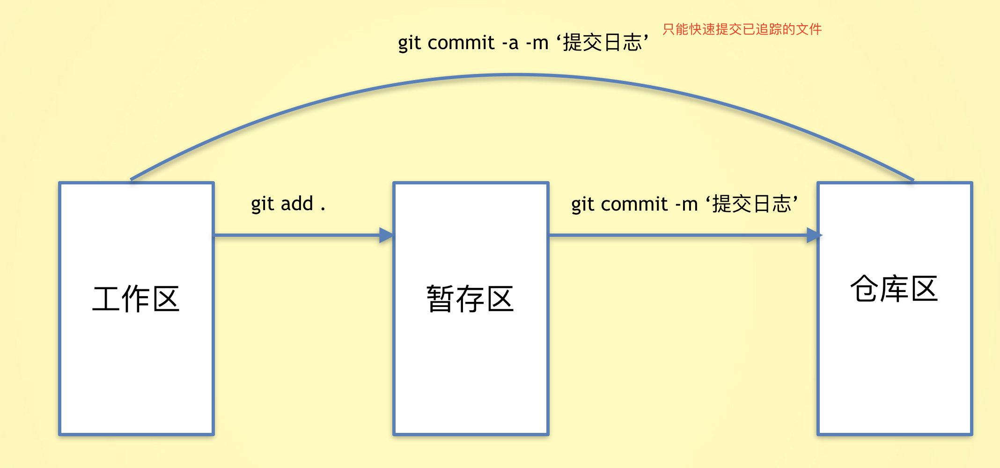

### 1.2.4 git重置

#### git reset

+ 作用：版本回退，将代码恢复到已经提交的某一个版本中。
+ `git reset --hard 版本号` 将代码回退到某个指定的版本(版本号只要有前几位即可)
+ `git reset --hard head~1`将版本回退到上一次提交
  + ~1:上一次提交
  + ~2:上上次提交
  + ~0:当前提交

+ 当使用了`git reset`命令后，版本会回退，使用`git log`只能看到当前版本之前的信息。使用`git reflog`可以查看所有的版本信息

### 1.2.5 git忽视文件

> 在仓库中，有些文件是不想被git管理的，比如数据的配置密码、写代码的一些思路，node_modules等。git可以通过配置从而达到忽视掉一些文件，这样这些文件就可以不用提交了。

+ 在仓库的根目录创建一个`.gitignore`的文件，文件名是固定的。
+ 将不需要被git管理的文件路径添加到`.gitignore`中

```bash
# 忽视idea.txt文件
idea.txt

# 忽视css下的index.js文件
css/index.js

# 忽视css下的所有的js文件
css/*.js

# 忽视css文件夹
css
```

## 1.2 git分支操作

分支就是科幻电影里面的平行宇宙，当你正在电脑前努力学习Git的时候，另一个你正在另一个平行宇宙里努力学习SVN。

如果两个平行宇宙互不干扰，那对现在的你也没啥影响。不过，在某个时间点，两个平行宇宙合并了，结果，你既学会了Git又学会了SVN！


### 1.2.1 为什么要有分支？

+ 如果你要开发一个新的功能，需要2周时间，第一周你只能写50%代码，如果此时立即提交，代码没写完，不完整的代码会影响到别人无法工作。如果等代码写完再提交，代码很容易丢失，风险很大。
+ 有了分支，你就可以创建一个属于自己的分支，别人看不到，也不影响别人，你在自己的分支上工作，提交到自己的分支上，等到功能开发完毕，一次性的合并到原来的分支。这样既安全，又不影响他人工作。

### 1.2.2 git分支命令

> 在git中，分支实质上仅仅是一个指针，每次代码提交后，这个分支指针就会向后移动，保证一直指向最后一次提交的的版本。git中使用HEAD指向当前分支

#### 1.2.2.1 创建分支

+ `git branch 分支名称`创建分支，分支中的代码，在创建时与当前分支的内容完全相同。
+ git在第一次提交时，就有了一个叫`master`的主分支。
+ `git branch dev`，创建了一个叫做dev的分支

#### 1.2.2.2  查看分支

+ `git branch`可以查看所有的分支，
+ 在当前分支的前面会有一个`*`
+ 在git中，有一个特殊指针`HEAD`,永远会指向当前分支

#### 1.2.2.3 切换分支

+ `git checkout 分支名称`切换分支  HEAD指针指向了另一个分支
+ 在当前分支的任何操作，都不会影响到其他的分支，除非进行了分支合并。
+ 提交代码时，会生产版本号，当前分支会指向最新的版本号。

#### 1.2.2.4  创建并切换分支

+ `git checkout -b 分支名称` 创建并切换分支
+ 切换分支会做两件事情
  + 创建一个新分支
  + 把head指针指向当前的分支

#### 1.2.2.5  删除分支

+ `git branch -d 分支名称` 可以删除分支
+ 注意：不能在当前分支删除当前分支，需要切换到其他分支才能删除。
+ 注意：`master`分支是可以删除的，但是不推荐那么做。

#### 1.2.2.6 合并分支

+ `git merge 分支名称` 将其他分支的内容合并到当前分支。
+ 在`master`分支中执行`git merge dev` 将`dev`分支中的代码合并到`master`分支
+ [分支合并](https://git-scm.com/book/zh/v1/Git-%E5%88%86%E6%94%AF-%E5%88%86%E6%94%AF%E7%9A%84%E6%96%B0%E5%BB%BA%E4%B8%8E%E5%90%88%E5%B9%B6)

### 1.2.3 git合并冲突

+ 对于同一个文件，如果有多个分支需要合并时，容易出现冲突。
+ 合并分支时，如果出现冲突，只能手动处理，再次提交，一般的作法，把自己的代码放到冲突代码的后面即可。

## 二、综合案例

### 2.1 接口地址

+ **接口路径地址**：    <http://ajax-api.itheima.net/>

### 2.2 项目初始化

1. 基于模板，初始化仓库

```
git init
```

2. 提交到暂存区

```
git add .

git commit -m '初始化仓库'
```

3. 创建develop分支

```
git checkout -b develop
```

### 2.3 注册功能

#### 2.3.1 bootstrap轻提示 - 测试

官网地址：<https://v5.bootcss.com/docs/components/toasts/>

1. 准备结构,  必须有 `toast` 类

```jsx
<div id="box" class="toast">我是轻提示</div>
```

2. 引包 js 和 css

```jsx
<link rel="stylesheet" href="./bootstrap/bootstrap.min.css" />
<link rel="stylesheet" href="./bootstrap/bootstrap-icons.css" />
<script src="./bootstrap/bootstrap.min.js"></script>
```

3. 编写js代码实例化

```jsx
// bootstrap轻提示
const toastBox = document.querySelector('#box')
const toast = new bootstrap.Toast(toastBox, {
  animation: true, // 开启过渡动画
  autohide: true, // 开启自动隐藏
  delay: 3000 // 3000ms后自动隐藏
})

toast.show()
```

#### 2.3.2 bootstrap轻提示 - 应用

1. 准备结构（已准备）
2. 引包（已引入）
3. 编写js代码

```jsx
// bootstrap轻提示
const toastBox = document.querySelector('#myToast')
const toast = new bootstrap.Toast(toastBox, {
  animation: true, // 开启过渡动画
  autohide: true, // 开启自动隐藏
  delay: 3000 // 3000ms后自动隐藏
})
const tip = (msg) => {
  toastBox.querySelector('.toast-body').innerHTML = msg
  toast.show()
}


// === 测试代码 ===
tip('请输入用户名')
```

因为代码是常用的，开发一般就会帮如到公共的js文件 `common.js`

#### 2.3.3 表单数据收集 - 测试

文档地址：<https://www.npmjs.com/package/form-serialize>

1. 准备form表单, 表单元素需要添加 name

```html
<form id="form">
  <input type="text" name="username"> <br>
  <input type="password" name="password"> <br>
  <button>登录</button>
</form>
```

2. 引包

```jsx
<script src="./lib/form-serialize.js"></script>
```

3. 注册事件，收集表单信息

```jsx
const btn = document.querySelector('button')
const form = document.querySelector('#form')
btn.addEventListener('click', function(e) {
  e.preventDefault()
  console.log(serialize(form))
  console.log(serialize(form, { hash: true }))
})
```

#### 2.3.4 表单数据收集 - 应用

1. 准备form表单 (页面已准备)
2. 引包 （已引入）
3. 注册事件，收集表单信息

```jsx
document.querySelector('#btn-register').addEventListener('click', async () => {
  const data = serialize(document.querySelector('form'), { hash: true })
  console.log(data);
})
```

#### 2.3.5 注册逻辑实现

1. common.js 配置请求基地址

```jsx
axios.defaults.baseURL = 'http://ajax-api.itheima.net'
```

2. 非空检验后，请求注册，处理异常提示

```jsx
btnRegister.addEventListener('click', async function() {
  // 收集表单数据
  const data = serialize(form, { hash: true })
  // 非空校验，长度校验
  if (!data.username || data.username.trim() === '') return tip('用户名不能为空')
  if (!data.password || data.password.trim() === '') return tip('密码不能为空')
  if (data.password.length < 6) return tip('密码的长度不能小于 6 位')

  // 发送请求 await 只会等待成功的结果，如果要处理失败，需要try catch
  try {
    await axios.post('/register', data)
    tip('注册成功')
    
    setTimeout(() => {
      location.href = './login.html' // 注册成功跳转登录
    }, 500)
  } catch (e) {
    // console.dir(e)
    // 状态码409, 表示用户名已存在
    if (e.response.status === 409) {
      return tip(e.response.data.message)
    }
    tip('注册失败，服务器繁忙')
  }
})
```

**代码提交**

```
git add .

git commit -m '注册功能完成'
```

### 2.4 登录功能

登录的代码如下：

```jsx
document.querySelector('#btn-login').addEventListener('click', async function() {
  const data = serialize(document.querySelector('form'), { hash: true })
  // 非空校验
  if (!data.username || data.username.trim() === '') return tip('用户名不能为空')
  if (!data.password || data.password.trim() === '') return tip('密码不能为空')
  if (data.password.length < 6) return tip('密码的长度不能小于6位')

  try {
    await axios.post('/login', data)
    tip('登录成功')
    location.href = './index.html'
  }
  catch (e) {
    tip('用户名或者密码错误')
  }
})
```

**代码提交**

```
git add .

git commit -m '登录功能完成'
```

## 2.5 页面访问权限控制

### 2.5.1 什么是jwt身份认证

在前后端分离模式的开发中，服务器如何知道来访者的身份呢？

+ 在登录后，服务器会响应给用户一个 令牌 （token）
+ 令牌中会包括该用户的id等唯一标识
+ 浏览器收到令牌后，自己保存
+ 下次请求其他接口时，（在请求头中）携带这个令牌去请求
+ 这样服务器就知道来访者的身份了，服务器就会为该用户开发接口的访问权限，并处理该用户的数据

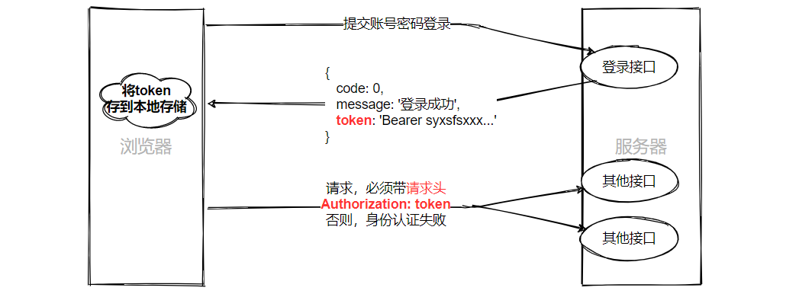

> 登录后：要将token保存到本地存储中了。顺带个人信息也存一下，用于回显。

```jsx
document.querySelector('#btn-login').addEventListener('click', async function() {
  const data = serialize(document.querySelector('form'), { hash: true })
  // 非空校验
  if (!data.username) return tip('请输入用户名')
  if (!data.password) return tip('请输入密码')
  if (data.password.length < 6) return tip('密码的长度不能小于6位')

  try {
    const res = await axios.post('/login', data)
    localStorage.setItem('user-token', res.data.data.token)
    localStorage.setItem('user-name', res.data.data.username)
    tip('登录成功')
    location.href = './index.html'
  }
  catch (e) {
    tip('用户名或者密码错误')
  }
})
```

### 2.5.2 页面访问拦截

浏览器端，可以通过合理使用令牌，控制页面的访问权限。

比如，用户默认只能访问登录页，如果不登录就不能访问首页，怎么做？


**登录拦截**：判断本地存储是否有token, 没有token拦截到登录

```html
<!-- 本地存储有token，则说明用户登录了；没有token，则说明用户没有登录，不允许访问首页 -->
<script>
  if (localStorage.getItem('user-token') === null) location.href = './login.html'
</script>
```

> 注意：上述判断只能判断token有没有，但不能判断token的真假，所以将来需要发送Ajax请求，根据服务器响应结果再次判断

**代码提交**

```
git add .

git commit -m '页面访问拦截完成'
```

### 2.5.3 显示用户名称和退出登录

`common.js`

```js
// 显示用户名称和退出登录
const userName = document.querySelector('.navbar .font-weight-bold')
const logout = document.querySelector('#logout')
//如果userName是存在的，因为再公共js，不能保证每个页面都有这两个元素
if (userName) {
  userName.innerHTML = localStorage.getItem('user-name')
}
//如果logout是存在的
if (logout) {
  logout.addEventListener('click', () => {
    localStorage.removeItem('user-token')
    localStorage.removeItem('user-name')
    location.href = './login.html'
  })
}
```

退出登录：注册事件，移除本地登录状态，跳转登录页

## 2.6 axios 拦截器

### 2.6.1 请求接口 401 错误解决

在首页获取后台统计数据，发现401

```jsx
// DOMContentLoaded 当初始的 HTML 文档被完全加载和解析完成之后,DOMContentLoaded 事件被触发
// 而无需等待样式表、图像和子框架的完成加载
document.addEventListener('DOMContentLoaded', async () => {
  const res = await axios.get('/dashboard')
  console.log(res);
})
```

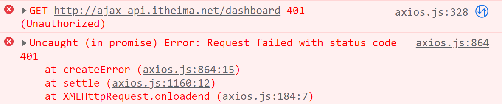

原因：

1. 后台接口需要进行身份认证，请求时，需要在请求头中携带 token
2. 未携带token，或token过期，后台都会返回401

```jsx
document.addEventListener('DOMContentLoaded', async () => {
  const token = localStorage.getItem('user-token')
  const res = await axios.get('/dashboard', {
    headers: {
      'Authorization': token
    }
  })
  console.log(res);
})
```

### 2.6.2 请求拦截器

利用请求拦截器,  本地读取token， 设置给请求头

```jsx
// 添加请求拦截器
axios.interceptors.request.use(function (config) {
    
  // 在发送请求之前做些什么
  const token = localStorage.getItem('user-token')
  if (token) {
    config.headers.Authorization = token
  }
    
  return config;
}, function (error) {
  // 对请求错误做些什么
  return Promise.reject(error);
});

// 添加响应拦截器
axios.interceptors.response.use(function (response) {
  // 对响应数据做点什么
  return response;
}, function (error) {
  // 对响应错误做点什么
  return Promise.reject(error);
});
```

### 2.6.3 响应拦截器

1. token时效两小时，修改本地token，发现401 （模拟token失效）
2. 处理401状态码， 清除本地信息，跳转登录
3. 分析数据层级，进行数据剥离

```jsx
// 添加响应拦截器
axios.interceptors.response.use(
  function (response) {
    // 对响应数据做点什么
    return response.data
  },
  function (error) {
    // 对响应错误做点什么
    if (error.response.status === 401) {
      localStorage.removeItem('user-token')
      localStorage.removeItem('user-name')
      location.href = './login.html'
    }
    return Promise.reject(error)
  }
)
```

4. 数据剥离后，更新login逻辑

```jsx
document.querySelector('#btn-login').addEventListener('click', async () => {
  ...
  try {
    const res = await axios.post('/login', data)
    localStorage.setItem('user-token', res.data.token)
    localStorage.setItem('user-name', res.data.username)
    location.href = './index.html'
  } catch (e) {
    tip('用户名密码错误')
  }
})
```

**代码提交**

```
git add .

git commit -m 'axios拦截器添加完成'
```

## 2.7 git远程仓库

### 2.7.1 github、gitee、gitlab

+ git是一个版本控制工具。
+ github是一个代码托管平台，开源社区，是git的一个远程代码仓库平台。

```javascript
//1. gitHub是一个面向开源及私有软件项目的托管平台，因为只支持git 作为唯一的版本库格式进行托管，故名gitHub。
//2. github免费，代码所有人都能看到，但是只有你自己能修改。付费的可以隐藏。
//3. 创建git项目时，不能有中文。
```

[github官网](https://github.com/)： 国外开源 git 代码托管平台

[开源中国-git](https://git.oschina.net/):  国内开源 git 代码托管平台

[gitlab](https://about.gitlab.com/)：企业级 git 代码托管平台

### 2.7.2 码云创建远程仓库

1. 新建右上角仓库

   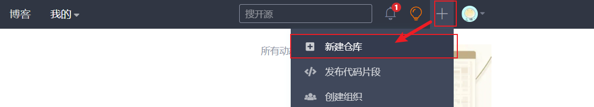

2. 输入仓库名  **不勾初始化！！！**

   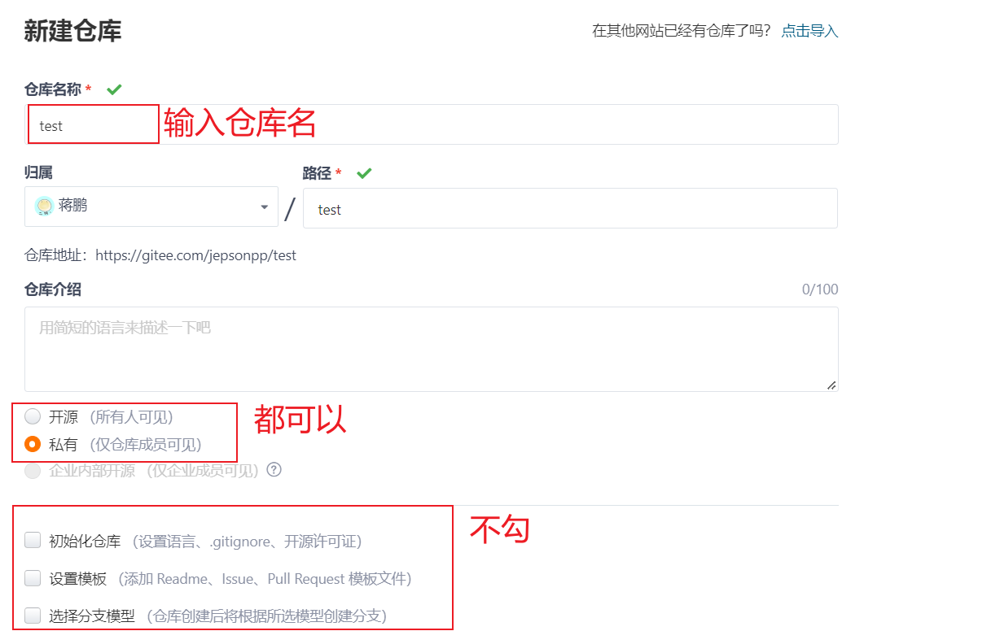

3. 点击创建

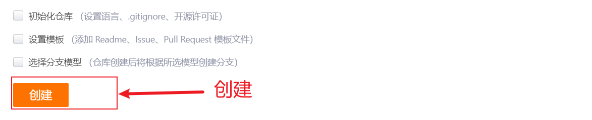

### 2.7.3 SSH免密码登陆

git支持多种数据传输协议：

+ https协议：`https://gitee.com/jepsonpp/test.git`  需要输入用户名和密码
+ ssh协议：`git@gitee.com:jepsonpp/test.git`   可以配置免密码登录

每次push或者pull代码，如果使用https协议，那么都需要输入用户名和密码进行身份的确认，非常麻烦。

+ github为了账户的安全，需要对每一次push请求都要验证用户的身份，只有合法的用户才可以push
+ 使用ssh协议，配置ssh免密码，可以做到免密码往github推送代码

### 2.7.4 SSH免密码登录配置

+ 1 创建SSH Key：`ssh-keygen -t rsa`    （注意：这些命令需要在bash中敲）
+ 2 在文件路径 `C:\用户\当前用户名\` 找到 `.ssh` 文件夹
+ 3 文件夹中有两个文件：
  + 私钥：`id_rsa`
  + 公钥：`id_rsa.pub`
+ 4 在 `码云-> 设置 -> SSH公钥`页面中
+ 5 粘贴 公钥 `id_rsa.pub` 内容到对应文本框中， 添加公钥

### 2.7.5 git push

+ 作用：将本地仓库中代码提交到远程仓库
+ `git push 仓库地址 分支名`   将代码提交到远程仓库对应分支
+ 例子：`git push git@gitee.com:jepsonpp/test.git master`

```
git push <远程主机名> <本地分支名>:<远程分支名>
如果本地分支名与远程分支名相同，则可以省略冒号
```

### 2.7.6 git remote

每次push操作都需要带上远程仓库的地址，非常的麻烦，我们可以给仓库地址设置一个别名

```bash
# 给远程仓库设置一个别名
git remote add 仓库别名 仓库地址
git remote add origin git@gitee.com:jepsonpp/test.git

# 删除origin这个别名
git remote remove origin
```

演示命令：`git push -u 仓库别名 分支名`

将git push推送的仓库、分支，设置为默认仓库 分支。之后使用git push 不需要再写仓库别名和分支。

当你要push其他仓库，只需要按照正常的写法就行

### 2.7.8 git clone

+ 作用：克隆远程仓库的代码到本地
+ git clone [远程仓库地址]
+ `git clone git@gitee.com:jepsonpp/test.git`会在本地新建一个`test`文件夹
+ 在test中包含了一个`.git`目录，用于保存所有的版本记录，同时test文件中还有最新的代码，可以进行后续的开发。
+ git克隆默认会使用远程仓库的项目名字，也可以自己指定。命令：`git clone [远程仓库地址] [本地项目名]`

tips: `git branch -a`  查看分支

### 2.7.9 git pull

+ 作用：拉取更新，将远程的代码下载合并到本地的分支

+ 通常在push前，需要先pull一次。

```bash
# 获取远程仓库的更新，并且与本地的分支进行合并
git pull
git pull <远程主机名> <分支名>
git pull origin login  # 获取远程分支的更新，并更新合并到login分支
```

### 2.7.10 下载远端分支本地

`checkout` 的 `-t`(或) `--track`)选项仅在创建新的(本地)分支时使用

先在本地建立一个分支，并切换到该分支，然后从远程分支上同步代码到该分支上，并建立关联

```git
git checkout -t origin/develop     #远端分支名和本地新建分支名同名
```

**后续拉取该分支的更新，就是切换到该分支，git  pull  origin 分支名**

## 2.8 综合练习

1. 将数据可视化项目上传到码云仓库,  主分支与开发分支均要上传

```git
git push origin master

git push origin develop
```

2. 删除本地项目，通过克隆把远端仓库项目拉取下来，切换到develop分支

```git
git clone 仓库地址

git checkout -t origin/develop
```

## 2.9 Echarts 入门

### 2.9.1 Echarts-介绍

> ECharts，一个使用 JavaScript 实现的开源可视化库，可以流畅的运行在 PC 和移动设备上，兼容当前绝大部分浏览器（IE8/9/10/11，Chrome，Firefox，Safari等），底层依赖矢量图形库 [ZRender](https://github.com/ecomfe/zrender)，提供直观，交互丰富，可高度个性化定制的数据可视化图表。

大白话：

+ 是一个JS插件
+ 性能好可流畅运行PC与移动设备
+ 兼容主流浏览器
+ 提供很多常用图表，且可**定制**。

### 2.9.2 Echarts-体验

官方教程：[快速上手ECharts](https://echarts.apache.org/handbook/zh/get-started/)

#### 2.9.2.1 使用步骤

+ 下载echarts  <https://echarts.apache.org/zh/download.html>
+ 引入echarts
+ 准备一个具备大小（宽高）的 DOM

```html
<div id="main" style="width: 600px; height:400px;"></div>
```

+ 初始化echart实例

```js
const myChart = echarts.init(document.getElementById('main'));
```

+ 指定图表的配置项和数据 (根据文档提供示例找到option)

```js
// 指定图表的配置项和数据
const option = {
  title: {
    text: 'ECharts 入门示例',
  },
  tooltip: {},
  legend: {
    data: ['销量'],
  },
  xAxis: {
    data: ['衬衫', '羊毛衫', '雪纺衫', '裤子', '高跟鞋', '袜子'],
  },
  yAxis: {},
  series: [
    {
      name: '销量',
      type: 'bar',
      data: [5, 20, 36, 10, 10, 20],
    },
  ],
}
```

+ 使用刚指定的配置项和数据显示图表

```js
myChart.setOption(option);
```

#### 2.9.2.2 示例配置项&文档查看方式

上节我们绘制了一个简单的柱状图图表，本节教大家如何通过文档中查看**配置项option**的一些说明

讲解内容:  通过文档找到刚刚完成的柱状图配置项对应的一些配置的说明

```js
// 指定图表的配置项和数据
const option = {
    title: {  // 标题组件
        text: 'ECharts 入门示例', // 主标题文本
    },
    tooltip: {}, // 提示框组件
    legend: {  // 图例组件
        data: ['销量2']  // 图例的数据数组,对应series里的name
    },
    xAxis: { // 直角坐标系 grid 中的 x 轴
        data: ["衬衫", "羊毛衫", "雪纺衫", "裤子", "高跟鞋", "袜子"]
    },
    yAxis: { // 直角坐标系 grid 中的 y 轴, y轴里的data没有指定会自动从series.data里获取
    },
    series: [{
        name: '销量2', // 系列名称，用于tooltip的显示，legend 的图例筛选
        type: 'bar',  // 柱状图
        data: [5, 20, 36, 10, 10, 20] // 系列中的数据内容数组。数组项通常为具体的数据项
    }]
};
```

#### 2.9.2.3 基本配置项

+ series：系列列表。每个系列通过 `type` 决定自己的图表类型
+ xAxis：直角坐标系 grid 中的 x 轴
+ yAxis：直角坐标系 grid 中的 y 轴
+ grid：直角坐标系内绘图网格。
+ title：标题组件
+ tooltip：提示框组件
+ legend：图例组件
+ color：调色盘颜色列表

## 2.10 数据看板

### 2.10.1 展示概览

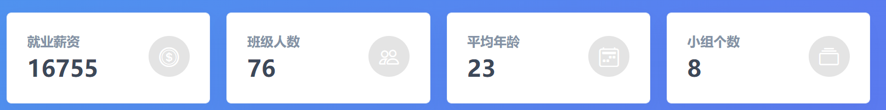

`js/index.js`

```jsx
document.addEventListener('DOMContentLoaded', async () => {
  const { data } = await axios.get('/dashboard')
  console.log(data);
  for (const key in data.overview) {
    document.querySelector(`[name=${key}]`).innerHTML = data.overview[key]
  }
})
```

### 2.10.2 薪资走势

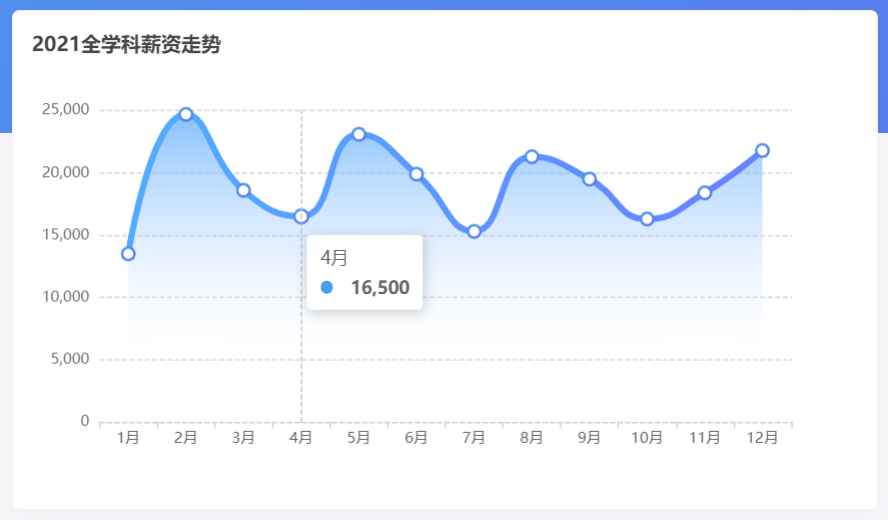

基本步骤：

1. 官网找到相似案例
2. 按照需求定制图表

相似案例：<https://echarts.apache.org/examples/zh/editor.html?c=line-smooth>

图表基本初始化：

```jsx
document.addEventListener('DOMContentLoaded', async () => {
  ...
  initYearChart()
})

const initYearChart = () => {
  // 基于准备好的dom，初始化echarts实例
  const myChart = echarts.init(document.getElementById('line'))

  // 指定图表的配置项和数据
  const option = {
    xAxis: {
      type: 'category',
      data: ['Mon', 'Tue', 'Wed', 'Thu', 'Fri', 'Sat', 'Sun'],
    },
    yAxis: {
      type: 'value',
    },
    series: [
      {
        data: [820, 932, 901, 934, 1290, 1330, 1320],
        type: 'line',
        smooth: true,
      },
    ],
  }

  // 使用刚指定的配置项和数据显示图表。
  myChart.setOption(option)
}
```

按照需求定制：

+ 修改标题

```jsx
// 大标题
title: {
  text: '2021全学科薪资走势',
  left: 10,
  top: 15,
  textStyle: {
    fontSize: 16,
  },
},
```

+ 修改x轴样式 （x轴线 axisLine， x轴刻度标签 axisLabel）

```jsx
// x轴样式
xAxis: {
  type: 'category',
  data: ['1月', '2月', '3月', '4月', '5月', '6月'],
  axisLine: {
    show: true,
    lineStyle: {
      color: 'green',
      type: 'dashed'
    }
  },
  axisLabel: {
    show: true,
    color: 'red'
  }
},
```

+ 修改 y 轴分割线的样式

```jsx
// y轴样式
yAxis: {
  type: 'value',
  splitLine: {
    lineStyle: {
      type: 'dashed',
      color: ['#ccc']
    }
  }
},
```

+ 提示框组件

```jsx
// 提示框组件
tooltip: {
  show: true,
  trigger: 'axis',
},
```

+ grid 直角坐标系绘图网格

```jsx
// 刻度
grid: {
  left: '10%',
  top: '20%',
},
```

+ 折线的颜色 (线性渐变 - 可自行调色)

```jsx
// 折线颜色
color: [
  {
    type: 'linear',
    x: 0,
    y: 0,
    x2: 1,
    y2: 1,
    colorStops: [
      {
        offset: 0,
        color: 'red', // 0% 处的颜色
      },
      {
        offset: 1,
        color: 'orange', // 100% 处的颜色
      },
    ],
  },
],
```

+ 数据项配置

```jsx
series: [
  {
    data: [820, 932, 901, 934, 1290, 1330, 1320],
    type: 'line',
    smooth: true,
    symbol: 'emptyCircle',
    symbolSize: 10,
    lineStyle: {
      width: 5,
    },
  },
],
```

+ 区域颜色配置

```jsx
series: [
  {
    ...
    // 区域颜色
    areaStyle: {
      color: {
        type: 'linear',
        x: 0,
        y: 0,
        x2: 0,
        y2: 1,
        colorStops: [
          {
            offset: 0,
            color: '#ffdc88', // 0% 处的颜色
          },
          {
            offset: 0.8,
            color: 'rgba(255,255,255,0.1)', // 0% 处的颜色
          },
          {
            offset: 1,
            color: 'rgba(255,255,255,0)', // 100% 处的颜色
          },
        ],
      },
    },
  },
],
```

完整代码：

+ 基于数据，动态渲染，修改配色

```jsx
document.addEventListener('DOMContentLoaded', async () => {
  ...
  initYearChart(data.year)
})


const initYearChart = (year) => {
  // 基于准备好的dom，初始化echarts实例
  const myChart = echarts.init(document.getElementById('line'))

  // 指定图表的配置项和数据
  const option = {
    // 大标题
    title: {
      text: '2021全学科薪资走势',
      left: 10,
      top: 15,
      textStyle: {
        fontSize: 16
      }
    },
    // x轴样式
    xAxis: {
      type: 'category',
      data: year.map((item) => item.month),
      axisLine: {
        show: true,
        lineStyle: {
          color: '#ccc',
          type: 'dashed'
        }
      },
      axisLabel: {
        show: true,
        color: '#999'
      }
    },
    // y轴样式
    yAxis: {
      type: 'value',
      splitLine: {
        lineStyle: {
          type: 'dashed',
          color: ['#ccc']
        }
      }
    },
    // 提示框组件
    tooltip: {
      show: true,
      trigger: 'axis'
    },
    // 刻度
    grid: {
      left: '10%',
      top: '20%'
    },
    // 折线颜色
    color: [{
      type: 'linear',
      x: 0,
      y: 0,
      x2: 1,
      y2: 1,
      colorStops: [{
          offset: 0, color: '#499FEE' // 0% 处的颜色
      }, {
          offset: 1, color: '#5D75F0' // 100% 处的颜色
      }]
    }],
    // 数据项
    series: [
      {
        data: year.map((item) => item.salary),
        type: 'line',
        smooth: true,
        symbol: 'emptyCircle',
        symbolSize: 10,
        lineStyle: {
          width: 5,
        },
        // 区域颜色
        areaStyle: {
          color: {
            type: 'linear',
            x: 0,
            y: 0,
            x2: 0,
            y2: 1,
            colorStops: [{
                offset: 0, color: '#4d96ee' // 0% 处的颜色
            }, {
                offset: 0.8, color: 'rgba(255,255,255,0.1)' // 0% 处的颜色
            }, {
                offset: 1, color: 'rgba(255,255,255,0)' // 100% 处的颜色
            }]
          }
        }
      }
    ]
  };

  // 使用刚指定的配置项和数据显示图表。
  myChart.setOption(option)
}
```

### 2.10.3 薪资分布

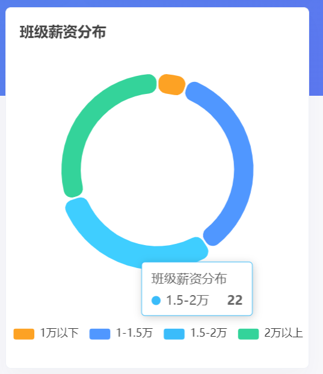

基本步骤：

1. 官网找到相似案例
2. 按照需求定制图表

相似案例：<https://echarts.apache.org/examples/zh/editor.html?c=pie-borderRadius>

基本初始化：

```jsx
document.addEventListener('DOMContentLoaded', async () => {
  ...
  // 班级薪资分布图
  initSalaryChart(data.salaryData)
})

const initSalaryChart = (salaryData) => {
  // 基于准备好的dom，初始化echarts实例
  const myChart = echarts.init(document.getElementById('salary'))

  const option = {
    tooltip: {
      trigger: 'item',
    },
    legend: {
      top: '5%',
      left: 'center',
    },
    series: [
      {
        name: 'Access From',
        type: 'pie',
        radius: ['40%', '70%'],
        avoidLabelOverlap: false,
        itemStyle: {
          borderRadius: 10,
          borderColor: '#fff',
          borderWidth: 2,
        },
        label: {
          show: false,
          position: 'center',
        },
        emphasis: {
          label: {
            show: true,
            fontSize: '40',
            fontWeight: 'bold',
          },
        },
        labelLine: {
          show: false,
        },
        data: [
          { value: 1048, name: 'Search Engine' },
          { value: 735, name: 'Direct' },
          { value: 580, name: 'Email' },
          { value: 484, name: 'Union Ads' },
          { value: 300, name: 'Video Ads' },
        ],
      },
    ],
  }

  // 使用刚指定的配置项和数据显示图表。
  myChart.setOption(option)
}
```

+ 定制标题

```jsx
title: {
  text: '班级薪资分布',
  top: 15,
  left: 10,
  textStyle: {
    fontSize: 16,
  },
},
```

+ 调整图例位置

```jsx
legend: {
  bottom: '6%',
  left: 'center',
},
```

+ 修改配色

```jsx
color: ['#FDA224', '#5097FF', '#3ABCFA', '#34D39A', '#ee6666'],
```

+ 修改图表样式

```jsx
series: [
  {
    name: '班级薪资分布',
    type: 'pie',
    radius: ['50%', '64%'], // 圆的半径
    center: ['50%', '45%'], // 圆的中心点坐标
    itemStyle: {
      borderRadius: 10,
      borderColor: '#fff',
      borderWidth: 2
    },
    label: {
      show: false, // 默认不显示数据项name
      position: 'center'
    },
    labelLine: {
      show: false // 刻度线，不显示
    },
    data: [
      { value: 200, name: '1万以下' },
      { value: 1000, name: '1万-1.5万' },
      { value: 580, name: '1.5万-2万' },
      { value: 484, name: '2万以上' }
    ]
  }
]
```

完整代码：

+ 基于数据，动态渲染

```jsx
document.addEventListener('DOMContentLoaded', async () => {
  ...
  initSalaryChart(data.salaryData)
})

const initSalaryChart = (salaryData) => {
  console.log(salaryData);
  // 基于准备好的dom，初始化echarts实例
  const myChart = echarts.init(document.getElementById('salary'))

  const option = {
    title: {
      text: '班级薪资分布',
      top: 15,
      left: 10,
      textStyle: {
        fontSize: 16,
      },
    },
    tooltip: {
      trigger: 'item',
    },
    legend: {
      bottom: '6%',
      left: 'center',
    },
    color: ['#FDA224', '#5097FF', '#3ABCFA', '#34D39A', '#ee6666'],
    series: [
      {
        name: '班级薪资分布',
        type: 'pie',
        radius: ['50%', '64%'], // 圆的半径
        center: ['50%', '45%'], // 圆的中心点坐标
        itemStyle: {
          borderRadius: 10,
          borderColor: '#fff',
          borderWidth: 2,
        },
        label: {
          show: false, // 默认不显示数据项name
          position: 'center',
        },
        labelLine: {
          show: false, // 刻度线，不显示
        },
        // data: [
        //   { value: 200, name: '1万以下' },
        //   { value: 1000, name: '1万-1.5万' },
        //   { value: 580, name: '1.5万-2万' },
        //   { value: 484, name: '2万以上' },
        // ],
        data: salaryData.map((item) => {
          return {
            value: item.g_count + item.b_count,
            name: item.label,
          }
        }),
      },
    ],
  }

  // 使用刚指定的配置项和数据显示图表。
  myChart.setOption(option)
}
```

### 2.10.4 每组薪资（期望&实际）

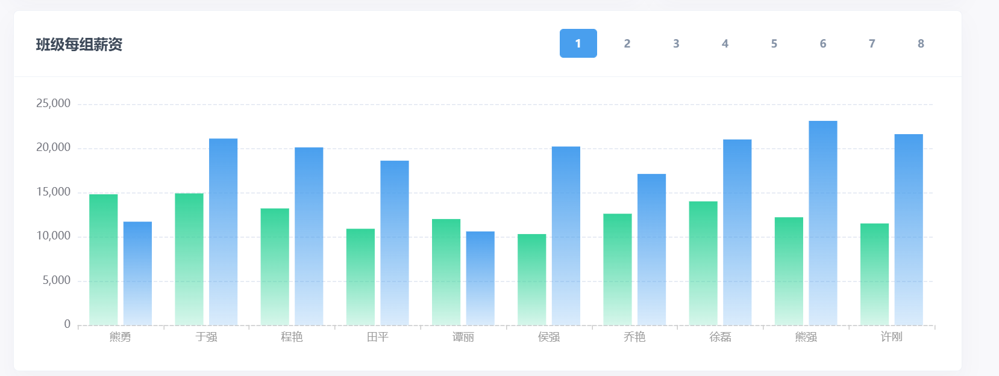

基本步骤：

1. 官网找到相似案例
2. 按照需求定制图表

相似案例：<https://echarts.apache.org/examples/zh/editor.html?c=bar-simple>

```jsx
document.addEventListener('DOMContentLoaded', async () => {
  ...
  initGroupChart(data.groupData)
})

const initGroupChart = (groupData) => {
  // 基于准备好的dom，初始化echarts实例
  const myChart = echarts.init(document.getElementById('lines'))

  const option = {
    xAxis: {
      type: 'category',
      data: ['Mon', 'Tue', 'Wed', 'Thu', 'Fri', 'Sat', 'Sun']
    },
    yAxis: {
      type: 'value'
    },
    series: [
      {
        data: [120, 200, 150, 80, 70, 110, 130],
        type: 'bar'
      }
    ]
  };

  // 使用刚指定的配置项和数据显示图表。
  myChart.setOption(option)
}
```

+ grid 调整图表区域大小

```jsx
grid: {
  left: 70,
  top: 30,
  right: 30,
  bottom: 50,
},
```

+ 配置x轴, y轴，tooltip, color

```jsx
xAxis: {
  type: 'category',
  data: ['Mon', 'Tue', 'Wed', 'Thu', 'Fri', 'Sat', 'Sun'],
  axisLine: {
    lineStyle: {
      color: '#ccc',
      type: 'dashed',
    },
  },
  axisLabel: {
    color: '#999',
  },
},
yAxis: {
  type: 'value',
  splitLine: {
    lineStyle: {
      type: 'dashed',
    },
  },
},
tooltip: {
  trigger: 'item',
},
color: [
  {
    type: 'linear',
    x: 0,
    y: 0,
    x2: 0,
    y2: 1,
    colorStops: [
      {
        offset: 0,
        color: '#34D39A', // 0% 处的颜色
      },
      {
        offset: 1,
        color: 'rgba(52,211,154,0.2)', // 100% 处的颜色
      },
    ],
  },
  {
    type: 'linear',
    x: 0,
    y: 0,
    x2: 0,
    y2: 1,
    colorStops: [
      {
        offset: 0,
        color: '#499FEE', // 0% 处的颜色
      },
      {
        offset: 1,
        color: 'rgba(73,159,238,0.2)', // 100% 处的颜色
      },
    ],
  },
],
```

+ 修改 series 数据项

```jsx
series: [
  {
    data: [12200, 17932, 13901, 13934, 21290, 23300, 13300, 13320],
    type: 'bar',
    name: '期望薪资',
  },
  {
    data: [22820, 19932, 16901, 15934, 31290, 13300, 14300, 18320],
    type: 'bar',
    name: '就业薪资',
  },
],
```

数据动态渲染，完整代码：

```jsx
const initGroupChart = (groupData) => {
  // 基于准备好的dom，初始化echarts实例
  const myChart = echarts.init(document.getElementById('lines'))

  const option = {
    grid: {
      left: 70,
      top: 30,
      right: 30,
      bottom: 50,
    },
    xAxis: {
      type: 'category',
      data: groupData[1].map(item => item.name),
      axisLine: {
        lineStyle: {
          color: '#ccc',
          type: 'dashed',
        },
      },
      axisLabel: {
        color: '#999',
      },
    },
    yAxis: {
      type: 'value',
      splitLine: {
        lineStyle: {
          type: 'dashed',
        },
      },
    },
    tooltip: {
      trigger: 'item',
    },
    color: [
      {
        type: 'linear',
        x: 0,
        y: 0,
        x2: 0,
        y2: 1,
        colorStops: [
          {
            offset: 0,
            color: '#34D39A', // 0% 处的颜色
          },
          {
            offset: 1,
            color: 'rgba(52,211,154,0.2)', // 100% 处的颜色
          },
        ],
      },
      {
        type: 'linear',
        x: 0,
        y: 0,
        x2: 0,
        y2: 1,
        colorStops: [
          {
            offset: 0,
            color: '#499FEE', // 0% 处的颜色
          },
          {
            offset: 1,
            color: 'rgba(73,159,238,0.2)', // 100% 处的颜色
          },
        ],
      },
    ],
    series: [
      {
        data: groupData[1].map(item => item.hope_salary),
        type: 'bar',
        name: '期望薪资',
      },
      {
        data: groupData[1].map(item => item.salary),
        type: 'bar',
        name: '就业薪资',
      },
    ],
  };

  // 使用刚指定的配置项和数据显示图表。
  myChart.setOption(option)
}
```

小组切换展示：

```jsx
// 每一组的薪资
const initGroupChart = (data) => {
  // 初始化图表
  ...
  // 利用事件委托给所有的按钮注册事件
  const btns = document.querySelector('#btns')
  btns.addEventListener('click', (e) => {
    if (e.target.tagName === 'BUTTON') {
      // 获取点击高亮
      btns.querySelector('.btn-blue')?.classList.remove('btn-blue')
      e.target.classList.add('btn-blue')

      // 获取组号
      const group = e.target.innerText
      // 切换数据
      option.xAxis.data = groupData[group].map((item) => item.name)
      option.series[0].data = groupData[group].map((item) => item.hope_salary)
      option.series[1].data = groupData[group].map((item) => item.salary)
      myChart.setOption(option)
    }
  })
}
```

### 2.10.5 男女薪资分布

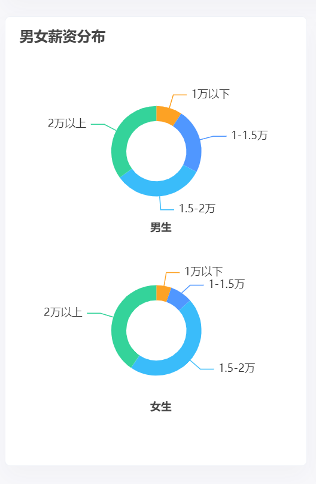

基本步骤：

1. 官网找到相似案例
2. 按照需求定制图表

相似案例：<https://echarts.apache.org/examples/zh/editor.html?c=pie-simple>

```jsx
document.addEventListener('DOMContentLoaded', async () => {
  ...
  initSalaryPieChart(data.salaryData)
})

const initSalaryPieChart = (salaryData) => {
  const myEchart = echarts.init(document.querySelector('#gender'))

  const option = {
    title: {
      text: 'Referer of a Website',
      subtext: 'Fake Data',
      left: 'center'
    },
    tooltip: {
      trigger: 'item'
    },
    legend: {
      orient: 'vertical',
      left: 'left'
    },
    series: [
      {
        name: 'Access From',
        type: 'pie',
        radius: '50%',
        data: [
          { value: 1048, name: 'Search Engine' },
          { value: 735, name: 'Direct' },
          { value: 580, name: 'Email' },
          { value: 484, name: 'Union Ads' },
          { value: 300, name: 'Video Ads' }
        ],
        emphasis: {
          itemStyle: {
            shadowBlur: 10,
            shadowOffsetX: 0,
            shadowColor: 'rgba(0, 0, 0, 0.5)'
          }
        }
      }
    ]
  }

  myEchart.setOption(option)
}
```

+ 准备两个饼图数据，去掉图例

```jsx
series: [
  {
    type: 'pie',
    radius: ['20%', '30%'],
    center: ['50%', '30%'],
    data: [
      { value: 1048, name: 'Search Engine' },
      { value: 735, name: 'Direct' },
      { value: 580, name: 'Email' },
      { value: 484, name: 'Union Ads' },
      { value: 300, name: 'Video Ads' }
    ]
  },
  {
    type: 'pie',
    radius: ['20%', '30%'],
    center: ['50%', '70%'],
    data: [
      { value: 1048, name: 'Search Engine' },
      { value: 735, name: 'Direct' },
      { value: 580, name: 'Email' },
      { value: 484, name: 'Union Ads' },
      { value: 300, name: 'Video Ads' }
    ]
  }
]
```

+ 添加标题

```jsx
title: [
  {
    text: '男女薪资分布',
    left: 10,
    top: 10,
    textStyle: {
      fontSize: 16,
    },
  },
  {
    text: '男生',
    left: '50%',
    top: '45%',
    textAlign: 'center',
    textStyle: {
      fontSize: 12,
    },
  },
  {
    text: '女生',
    left: '50%',
    top: '85%',
    textAlign: 'center',
    textStyle: {
      fontSize: 12,
    },
  },
],
```

+ color 配色

```jsx
color: ['#FDA224', '#5097FF', '#3ABCFA', '#34D39A'],
```

修改数据后，完整代码：

```jsx
document.addEventListener('DOMContentLoaded', async () => {
  ...
  initSalaryPieChart(data.salaryData)
})


const initSalaryPieChart = (data) => {
  const myEchart = echarts.init(document.querySelector('#gender'))
  myEchart.setOption({
    title: [
      {
        text: '男女薪资分布',
        left: 10,
        top: 10,
        textStyle: {
          fontSize: 16,
        },
      },
      {
        text: '男生',
        left: '50%',
        top: '45%',
        textAlign: 'center',
        textStyle: {
          fontSize: 12,
        },
      },
      {
        text: '女生',
        left: '50%',
        top: '85%',
        textAlign: 'center',
        textStyle: {
          fontSize: 12,
        },
      },
    ],
    color: ['#FDA224', '#5097FF', '#3ABCFA', '#34D39A'],
    tooltip: {
      trigger: 'item',
    },
    series: [
      {
        type: 'pie',
        radius: ['20%', '30%'],
        center: ['50%', '30%'],
        // data: [{name:'1万以下',value: 4},...]
        data: data.map((item) => ({ name: item.label, value: item.b_count })),
      },
      {
        type: 'pie',
        radius: ['20%', '30%'],
        center: ['50%', '70%'],
        // data: [{name:'1万以下',value: 4},...]
        data: data.map((item) => ({ name: item.label, value: item.g_count })),
      },
    ],
  })
}
```

### 2.10.6 籍贯分布

echarts社区：<https://www.makeapie.cn/echarts>

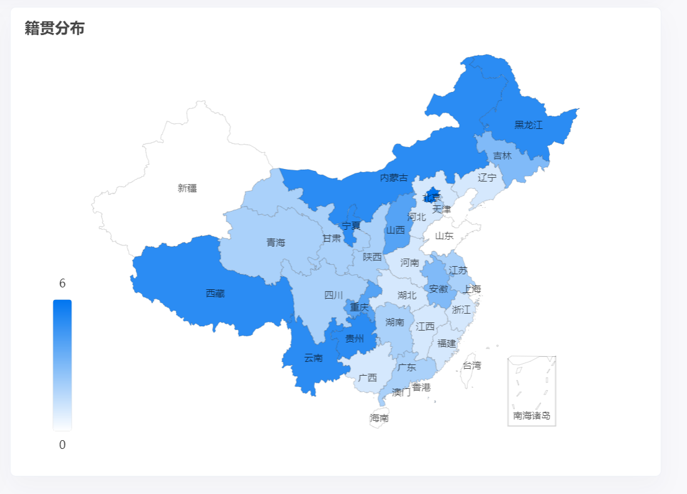

社区模板代码地址：<https://www.makeapie.cn/echarts_content/xr1W9m5LOG.html>

注意：直接 CV 下面的即可

```jsx
const initMapChart = (provinceData) => {
  const myEchart = echarts.init(document.querySelector('#map'))
  const dataList = [
    { name: '南海诸岛', value: 0 },
    { name: '北京', value: 0 },
    { name: '天津', value: 0 },
    { name: '上海', value: 0 },
    { name: '重庆', value: 0 },
    { name: '河北', value: 0 },
    { name: '河南', value: 0 },
    { name: '云南', value: 0 },
    { name: '辽宁', value: 0 },
    { name: '黑龙江', value: 0 },
    { name: '湖南', value: 0 },
    { name: '安徽', value: 0 },
    { name: '山东', value: 0 },
    { name: '新疆', value: 0 },
    { name: '江苏', value: 0 },
    { name: '浙江', value: 0 },
    { name: '江西', value: 0 },
    { name: '湖北', value: 0 },
    { name: '广西', value: 0 },
    { name: '甘肃', value: 0 },
    { name: '山西', value: 0 },
    { name: '内蒙古', value: 0 },
    { name: '陕西', value: 0 },
    { name: '吉林', value: 0 },
    { name: '福建', value: 0 },
    { name: '贵州', value: 0 },
    { name: '广东', value: 0 },
    { name: '青海', value: 0 },
    { name: '西藏', value: 0 },
    { name: '四川', value: 0 },
    { name: '宁夏', value: 0 },
    { name: '海南', value: 0 },
    { name: '台湾', value: 0 },
    { name: '香港', value: 0 },
    { name: '澳门', value: 0 },
  ]
  let option = {
    title: {
      text: '籍贯分布',
      top: 10,
      left: 10,
      textStyle: {
        fontSize: 16,
      },
    },
    tooltip: {
      trigger: 'item',
      formatter: '{b}: {c} 位学员',
      borderColor: 'transparent',
      backgroundColor: 'rgba(0,0,0,0.5)',
      textStyle: {
        color: '#fff',
      },
    },
    visualMap: {
      min: 0,
      max: 6,
      left: 'left',
      bottom: '20',
      text: ['6', '0'],
      inRange: {
        color: ['#ffffff', '#0075F0'],
      },
      show: true,
      left: 40,
    },
    geo: {
      map: 'china',
      roam: false,
      zoom: 1.0,
      label: {
        normal: {
          show: true,
          fontSize: '10',
          color: 'rgba(0,0,0,0.7)',
        },
      },
      itemStyle: {
        normal: {
          borderColor: 'rgba(0, 0, 0, 0.2)',
          color: '#e0ffff',
        },
        emphasis: {
          areaColor: '#34D39A',
          shadowOffsetX: 0,
          shadowOffsetY: 0,
          shadowBlur: 20,
          borderWidth: 0,
          shadowColor: 'rgba(0, 0, 0, 0.5)',
        },
      },
    },
    series: [
      {
        name: '籍贯分布',
        type: 'map',
        geoIndex: 0,
        data: dataList,
      },
    ],
  }
  myEchart.setOption(option)
}

```

动态设置数据后，完整代码：

```jsx
document.addEventListener('DOMContentLoaded', async () => {
  ...
  initMapChart(data.provinceData)
})

const initMapChart = (provinceData) => {
  const myEchart = echarts.init(document.querySelector('#map'))
  const dataList = [
    { name: '南海诸岛', value: 0 },
    { name: '北京', value: 0 },
    { name: '天津', value: 0 },
    { name: '上海', value: 0 },
    { name: '重庆', value: 0 },
    { name: '河北', value: 0 },
    { name: '河南', value: 0 },
    { name: '云南', value: 0 },
    { name: '辽宁', value: 0 },
    { name: '黑龙江', value: 0 },
    { name: '湖南', value: 0 },
    { name: '安徽', value: 0 },
    { name: '山东', value: 0 },
    { name: '新疆', value: 0 },
    { name: '江苏', value: 0 },
    { name: '浙江', value: 0 },
    { name: '江西', value: 0 },
    { name: '湖北', value: 0 },
    { name: '广西', value: 0 },
    { name: '甘肃', value: 0 },
    { name: '山西', value: 0 },
    { name: '内蒙古', value: 0 },
    { name: '陕西', value: 0 },
    { name: '吉林', value: 0 },
    { name: '福建', value: 0 },
    { name: '贵州', value: 0 },
    { name: '广东', value: 0 },
    { name: '青海', value: 0 },
    { name: '西藏', value: 0 },
    { name: '四川', value: 0 },
    { name: '宁夏', value: 0 },
    { name: '海南', value: 0 },
    { name: '台湾', value: 0 },
    { name: '香港', value: 0 },
    { name: '澳门', value: 0 },
  ]
  dataList.forEach((item) => {
    const obj = provinceData.find((it) => it.name.replace(/省|回族自治区|吾尔自治区|壮族自治区|特别行政区|自治区/g, '') === item.name)
    if (obj) item.value = obj.value
  })
  let option = {
    title: {
      text: '籍贯分布',
      top: 10,
      left: 10,
      textStyle: {
        fontSize: 16,
      },
    },
    tooltip: {
      trigger: 'item',
      formatter: '{b}: {c} 位学员',
      borderColor: 'transparent',
      backgroundColor: 'rgba(0,0,0,0.5)',
      textStyle: {
        color: '#fff',
      },
    },
    visualMap: {
      min: 0,
      max: 6,
      left: 'left',
      bottom: '20',
      text: ['6', '0'],
      inRange: {
        color: ['#ffffff', '#0075F0'],
      },
      show: true,
      left: 40,
    },
    geo: {
      map: 'china',
      roam: false,
      zoom: 1.0,
      label: {
        normal: {
          show: true,
          fontSize: '10',
          color: 'rgba(0,0,0,0.7)',
        },
      },
      itemStyle: {
        normal: {
          borderColor: 'rgba(0, 0, 0, 0.2)',
          color: '#e0ffff',
        },
        emphasis: {
          areaColor: '#34D39A',
          shadowOffsetX: 0,
          shadowOffsetY: 0,
          shadowBlur: 20,
          borderWidth: 0,
          shadowColor: 'rgba(0, 0, 0, 0.5)',
        },
      },
    },
    series: [
      {
        name: '籍贯分布',
        type: 'map',
        geoIndex: 0,
        data: dataList,
      },
    ],
  }
  myEchart.setOption(option)
}
```

## 2.11 学生信息渲染

封装获取数据渲染表格函数，页面初始化调用

```jsx
const renderList = async () => {
  const res = await axios.get('/students')
  const html = res.data
    .map((item, i) => {
      return `
          <tr>
            <td>${item.name}</td>
            <td>${item.age}</td>
            <td>${item.gender === 0 ? '男' : '女'}</td>
            <td>第${item.group}组</td>
            <td>${item.hope_salary}</td>
            <td>${item.salary}</td>
            <td>${item.province} ${item.city} ${item.area}</td>
            <td>
              <a href="javascript:;" class="text-success mr-3"><i data-id=${
                item.id
              } class="bi bi-pen"></i></a>
              <a href="javascript:;" class="text-danger"><i data-id=${
                item.id
              } class="bi bi-trash"></i></a>
            </td>
          </tr>
        `
    })
    .join('')
  document.querySelector('.list').innerHTML = html
  document.querySelector('.total').innerHTML = res.data.length
}
renderList()
```

## 2.12 学生信息删除

1. 事件委托绑定点击事件获取学生ID
2. 调用删除接口完成删除更新列表

```jsx
// 删除学生
document.querySelector('.list').addEventListener('click', async (e) => {
  const btn = e.target
  if (btn.classList.contains('bi-trash')) {
    // 删除
    try {
      await axios.delete(`/students/${btn.dataset.id}`)
      renderList()
    } catch (error) {
      alert('删除失败')
    }
  }
})
```

## 2.13 学生信息添加

### 2.13.1 bootstrap模态框

#### 2.13.1.1 模态框 - 显示

官方地址：<https://v5.bootcss.com/docs/components/modal/#methods>

1. 准备结构（已准备）
2. 实例化模态框
3. API方式显示隐藏

```jsx
const modalBox = document.querySelector('#modal')
const modal = new bootstrap.Modal(modalBox)

modal.show() // 显示
modal.hide() // 隐藏
modal.toggle() // 切换
```

#### 2.13.1.2 模态框 - 优化

```jsx
const modalBox = document.querySelector('#modal')
const modal = new bootstrap.Modal(modalBox)

document.querySelector('#openModal').addEventListener('click', () => {
  modalBox.querySelector('form').reset()
  modalBox.querySelector('.modal-title').innerHTML = '添加学员'
  modalBox.dataset.id = 'add'
  modal.show()
})
```

### 2.13.2 省市区联动

核心思路：

1. 动态渲染省份
2. 监听省份选择
3. 选择省动态渲染市
4. 监听市的选择
5. 选择市动态渲染地区

```jsx
const pselect = document.querySelector('[name=province]')
const cselect = document.querySelector('[name=city]')
const aselect = document.querySelector('[name=area]')

const initCity = async() => {
  // 动态渲染省份
  const { data: province } = await axios.get('/api/province')
  const phtml = province.map(item => `<option value="${item}">${item}</option>`).join('')
  pselect.innerHTML = `<option value="">--省份--</option>${phtml}`

  // 监听省份的选择
  pselect.addEventListener('change', async () => {
    // 省份重新选择，市和区肯定要重置
    cselect.value = ''
    aselect.value = ''

    // 动态渲染市
    const { data: city } = await axios.get('/api/city', { 
      params: { 
        pname: pselect.value 
      } 
    })
    const chtml = city.map((item) => `<option value="${item}">${item}</option>`).join('')
    cselect.innerHTML = `<option value="">--城市--</option>${chtml}`
  })

  // 监听城市的选择
  cselect.addEventListener('change', async () => {
    // 城市重新选择，区肯定要重置
    aselect.value = ''

    // 动态渲染地区
    const { data: area } = await axios.get('/api/area', { 
      params: { 
        pname: pselect.value, 
        cname: cselect.value 
      } 
    })
    const ahtml = area.map((item) => `<option value="${item}">${item}</option>`).join('')
    aselect.innerHTML = `<option value="">--地区--</option>${ahtml}`
  })
}
initCity()
```

### 2.13.3 调用添加接口完成添加

核心思路：

1. 点击确认按钮
2. 收集表单数据, 处理格式
3. 判断操作类型
4. 提交表单，页面渲染

```jsx
const form = modalBox.querySelector('form')
const submitBtn = document.querySelector('#submit')
// 添加学生
submitBtn.addEventListener('click', async () => {
  // 收集表单数据
  const data = serialize(form, { hash: true })
  // 处理格式（后台部分数据需要number格式）
  data.age = +data.age
  data.hope_salary = +data.hope_salary
  data.salary = +data.salary
  data.gender = +data.gender
  data.group = +data.group

  if (modalBox.dataset.id === 'add') {
    // 添加逻辑
    try {
      await axios.post('/students', data)
      modal.hide()
      renderList()
    } catch (error) {
      alert('添加失败')
    }
  } else {
    // 修改逻辑
    
  }
})
```

## 2.14 学生信息修改

### 2.14.1 点修改 - 显示弹框

核心思路：

1. 事件委托 - 注册点击事件
2. 设置弹框标题，记录操作 id
3. 调用API显示弹框

```jsx
document.querySelector('.list').addEventListener('click', async (e) => {
  const btn = e.target
  ...
  
  if (btn.classList.contains('bi-pen')) {
    modalBox.querySelector('.modal-title').innerHTML = '修改学员'
    modalBox.dataset.id = btn.dataset.id
    modal.show()
  }
})
```

### 2.14.2 显示弹框 - 请求回显

核心思路：

1. 根据 id 获取学生数据
2. 遍历表单实现基本回显
3. 处理性别回显
4. 处理省市区回显

核心代码：

1. 基本回显

```jsx
document.querySelector('.list').addEventListener('click', async (e) => {
  const btn = e.target
  ...
  
  if (btn.classList.contains('bi-pen')) {
    modalBox.querySelector('.modal-title').innerHTML = '修改学员'
    modalBox.dataset.id = btn.dataset.id
      
    // 获取数据回显
    const { data: student } = await axios.get(`/students/${btn.dataset.id}`)
    console.log(student)
    const fields = [...modalBox.querySelectorAll('form [name]')]
    fields.forEach(item => {
      if (item.name === 'gender') {

      } else {
        item.value = student[item.name]
      }
    })
      
    modal.show()
  }
})
```

2. 处理性别回显

```jsx
fields.forEach(item => {
  if (item.name === 'gender') {
    // 处理性别回显
    if (+item.value === student[item.name]) item.checked = true
  } else {
    item.value = student[item.name]
  }
})
```

3. 处理省市区回显

```jsx
// 删除功能 或 修改功能（通过事件委托）
document.querySelector('.list').addEventListener('click', async (e) => {
  const btn = e.target
  // 添加功能
  if (btn.classList.contains('bi-trash')) {
      ...
  }
  
  // 修改功能
  if (btn.classList.contains('bi-pen')) { 
    modalBox.querySelector('.modal-title').innerHTML = '修改学员'
    modalBox.dataset.id = btn.dataset.id

    const { data: student } = await axios.get(`/students/${btn.dataset.id}`)
    const fields = [...modalBox.querySelectorAll('form [name]')]
    fields.forEach(item => {
      if (item.name === 'gender') {
        if (+item.value === student[item.name]) item.checked = true
      } else {
        item.value = student[item.name]
      }
    })

    // 处理省市区的回显
    // 动态渲染市
    const { data: city } = await axios.get('/api/city', { 
      params: { 
        pname: pselect.value 
      } 
    })
    const chtml = city.map((item) => `<option value="${item}">${item}</option>`).join('')
    cselect.innerHTML = `<option value="">--城市--</option>${chtml}`
    cselect.value = student.city

    // 动态渲染区
    const { data: area } = await axios.get('/api/area', { 
      params: { 
        pname: pselect.value, 
        cname: cselect.value 
      } 
    })
    const ahtml = area.map((item) => `<option value="${item}">${item}</option>`).join('')
    aselect.innerHTML = `<option value="">--地区--</option>${ahtml}`
    aselect.value = student.area

    modal.show()
  }
})
```

### 2.14.3 调用接口完成修改

核心思路：

1. 根据修改的 id
2. 发送请求请求
3. 关闭弹框
4. 重新渲染

```jsx
// 添加 & 修改学生
submitBtn.addEventListener('click', async () => {
  // 收集表单数据
  const data = serialize(form, { hash: true })
  // 处理格式（后台部分数据需要number格式）
  data.age = +data.age
  data.hope_salary = +data.hope_salary
  data.salary = +data.salary
  data.gender = +data.gender
  data.group = +data.group

  if (modalBox.dataset.id === 'add') {
    // 添加逻辑
    try {
      await axios.post('/students', data)
      modal.hide()
      renderList()
      tip('添加成功')
    } catch (error) {
      alert('添加失败')
    }
  } else {
    // 修改逻辑
    try {
      await axios.put(`/students/${modalBox.dataset.id}`, data)
      modal.hide()
      renderList()
    } catch (error) {
      alert('修改失败')
    }
  }
})
```

## 2.15 码云page服务

1. 合并到master分支,  推送远程仓库

```
git checkout master

git merge develop

git push origin master
```

2. 使用pages服务发布静态页面

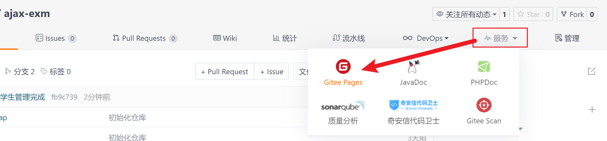

3. 实名认证

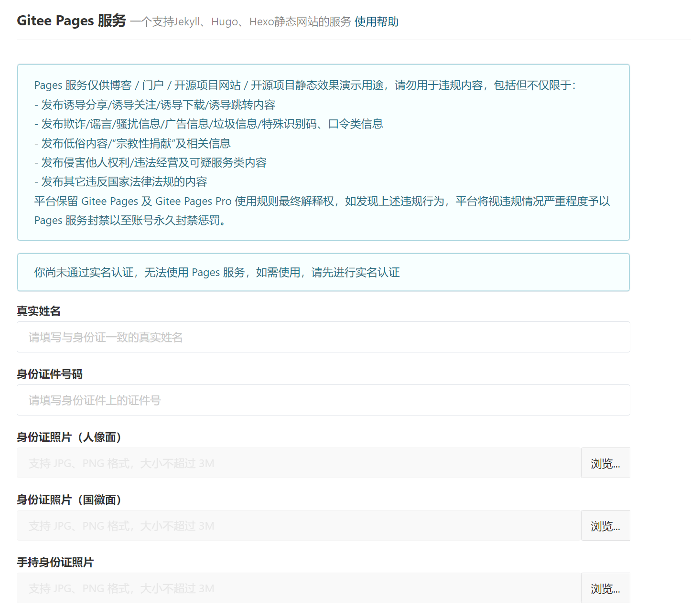

4. 开启服务

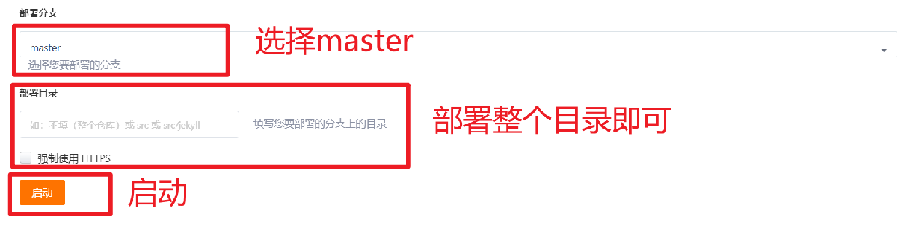
