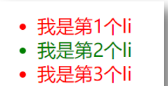
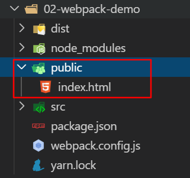
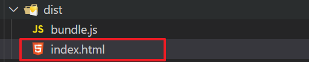
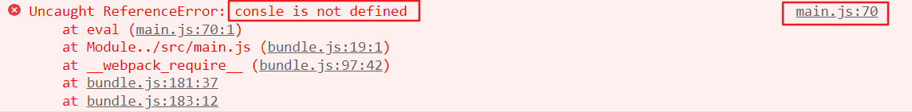
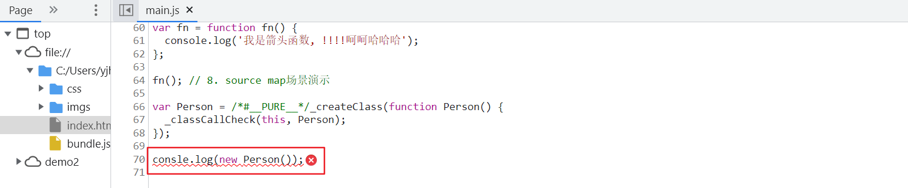
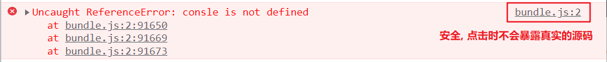
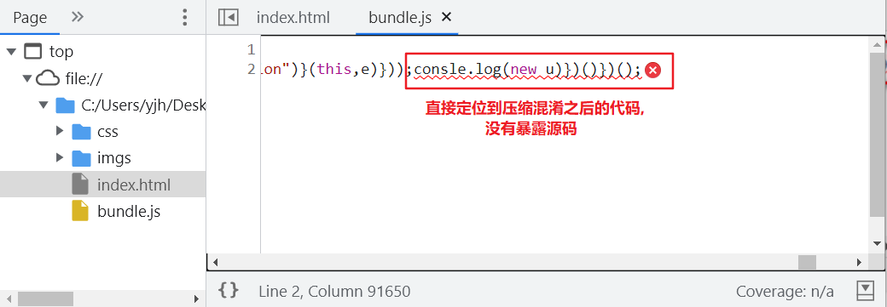
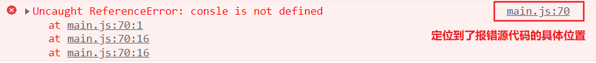
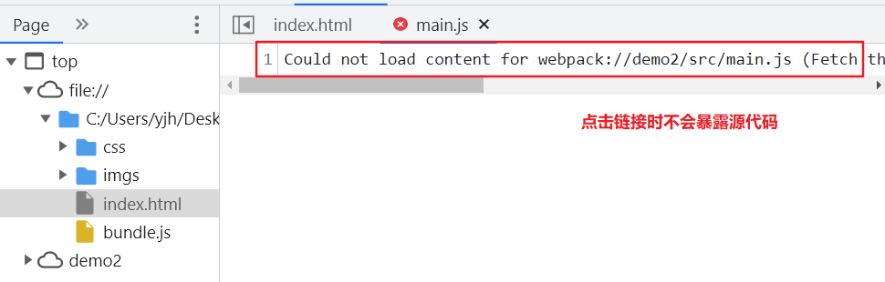

# 1. ES6 模块化

## 1.1 回顾：node.js 模块化

node.js 遵循了 CommonJS 的模块化规范。其中：

- 导入其它模块使用 **require()** 方法
- 模块对外共享成员使用 **module.exports**  对象

**模块化的好处：**

大家都遵守同样的模块化规范写代码，降低了沟通的成本，极大方便了各个模块之间的相互调用，利人利己。

## 1.2 前端模块化的分类 (了解)

在 ES6 模块化规范诞生之前，JavaScript 社区已经尝试并提出了 **AMD (国外 requirejs)、CMD (国内 seajs 淘宝)、CommonJS (nodejs)** 等模块化规范

但是，这些由社区提出的模块化标准，还是存在一定的差异性与局限性、并不是浏览器与服务器通用的模块化标准

例如:

- AMD 和 CMD 适用于浏览器端的 Javascript 模块化
- CommonJS 适用于服务器端的 Javascript 模块化

太多的模块化规范给开发者增加了学习的难度与开发的成本。因此，大一统的  **ES6 模块化**  规范诞生了！

## 1.3 什么是 ES6 模块化规范 (统一)

ES6 模块化规范是浏览器端与服务器端通用的模块化开发规范。

它的出现极大的降低了前端开发者的模块化学习成本，开发者不需再额外学习 AMD、CMD 或 CommonJS 等模块化规范

ES6 模块化规范中定义：

- 每个 js 文件都是一个独立的模块
- 导入其它模块成员使用 `import`  关键字
- 向外共享模块成员使用 `export` 关键字

## 1.4 在 node.js 中体验 ES6 模块化

node.js 中默认仅支持 CommonJS 模块化规范，若想基于 node.js 体验与学习 ES6 的模块化语法，

可以按照如下两个步骤进行配置：

1. 确保安装了 v14.15.1 或更高版本的 node.js
2. 在 package.json 的根节点中添加 "type": "module" 节点


## 1.5 模块化的基本语法

ES6 的模块化主要包含如下 3 种用法：

- 默认导出 和 默认导入
- 按需导出 和 按需导入
- 直接导入 并 执行模块中的代码

### 1.5.1 默认导出 和 默认导入

默认导出的语法： `export default 默认导出的成员`，只允许使用一次export default

默认导入的语法： `import 接收名称 from '模块标识符'`

默认导出

```jsx
const a = 10
const b = 20

const fn  = () => {
  console.log('这是一个函数')
}

// 默认导出
// export default a  // 导出一个值
export default {
  a,
  b,
  fn
}
```

默认导入

```jsx
import result from './xxx.js'
console.log(result)
```

**注意点:**

- **每个模块中，只允许使用唯一的一次 export default** !
- 默认导入时的接收名称可以任意名称，只要是合法的成员名称即可

### 1.5.2 按需导入与按需导出

按需导出的语法： `export const a = 10`

按需导入的语法： `import { a } from '模块标识符'`

按需导出

```jsx
export const a = 10
export const b = 20
export const fn = () => {
  console.log('内容')
}
```

按需导入

```jsx
import { a, b as c, fn } from './xxx.js'               // b as c  将b改名为c
```

**注意点:**

- 每个模块中可以使用多次按需导出
- 按需**导入的成员名称必须和按需导出的名称保持一致**
- 按需导入时，可以使用as 关键字进行重命名
- 按需导入可以和默认导入一起使用

### 1.5.3 直接导入执行模块代码

如果只想单纯地执行某个模块中的代码，并不需要得到模块中向外共享的成员。

此时，可以直接导入并执行模块代码

```jsx
import './xxx.js'
```

# 2. 前置 - yarn 包管理器

快速、可靠、安全的依赖管理工具。和 npm 类似, 都是包管理工具, 可以用于下载包

```
npm i jquery
```

下载地址: <https://yarn.bootcss.com/docs/install/#windows-stable>

windows本  **推荐通过软件包**  安装，也可以npm安装

```
npm i yarn -g
```

mac本通过命令全局安装

```txt
sudo npm i yarn -g
```

基本命令:

```text
1. 初始化
 yarn init  /  yarn init -y

2. 添加依赖
 yarn add [package]
 yarn add [package]@[version]

3. 移除包
 yarn remove [package]
             
4. 安装项目全部依赖            
 yarn 或者 yarn install

5. 全局
 安装: yarn global add [package]
 卸载: yarn global remove [package]
```

# 3. webpack概述

> webpack 是一个基于 NodeJS 的 **静态模块打包器 (module bundler)**
>
> 将来要学的 vue-cli 脚手架环境, 集成了 webpack, 所以才能对各类文件进行打包处理

[webpack官网](https://webpack.js.org/)

## 3.1 webpack 能做什么

webpack是一个 静态模块 打包器

1. 语法转换
   - less/sass转换成css
   - ES6转换成ES5
   - typescript转换成原生js
   - ...
2. html/css/js 代码压缩合并 (打包)
3. webpack可以在开发期间提供一个开发服务器， 提高开发效率

**项目一般先打包再上线**

## 3.2 webpack - 基本使用

注意: 文档有可能不全的, 先按照我们笔记步骤, 先配置, 先上手

以后开发: 对着官网, 对着博客, 去配 (博客的时间, 找近几年的)

<https://webpack.docschina.org/>

## 3.3 webpack 打包演示

1. 建目录  dist    src/main.js

2. 初始化

   ```
   yarn init -y
   ```

3. 安装依赖包  ( -D: 将安装包作为开发阶段的依赖, 只在开发阶段使用, 实际上线不要的, 可以加 -D)

   dependencies  项目依赖, 实际上线, 也要用的包, 比如 jquery    yarn add jquery

   devDependencies 开发依赖, 实际上线, 不用这个包, 只在开发打包过程中用   -D

   ```
   yarn add webpack  webpack-cli  -D
   ```

4. 配置scripts

   ```js
   scripts: {
    "build": "webpack --config webpack.config.js"
   }
   ```

   `--config  webpack.config.js` 这个配置文件名为默认值, 不加也会默认找这个文件

5. 提供 webpack.config.js

   基础版本

   ```jsx
   module.exports = {
     // 入口: 从哪个文件开始打包
     entry: './src/main.js'
   }
   ```

6. 执行脚本

   ```jsx
   yarn build
   ```

小测试:

​ 假定在main.js中导入一个  aa.js,  多个文件需要打包, wepack会打包成一个文件, 可以节约请求的次数

```js
import './js/aa.js'
console.log('这是main模块')
```

## 3.4 package.json 中 scripts的使用说明

在package.json文件中, 可以配置 scripts ...  配置自己的命令

```
"scripts": {
 "pp": "yarn add jquery",
 "build": "webpack --config webpack.config.js"
}

yarn xxx
npm run pp
npm run build
```

**运行方式:  npm  run  xx**

特殊的命令:  start / stop  可以省略 run

```
npm run start  => npm start      =>  yarn start
npm run stop  => npm stop        =>  yarn stop
```

使用 yarn 直接不需要加 run  

```
npm run pp  =>  yarn pp
npm run build => yarn build
```

## 3.5 基本配置 - 配置入口出口模式

参考文档:   [https://webpack.docschina.org/concepts/#入口-entry-](https://webpack.docschina.org/concepts/#入口-entry-)

```js
const path = require('path')

module.exports = {
  // entry: 配置入口文件 (从哪个文件开始打包) 
  entry: './src/main.js',

  // output: 配置输出 (打包到哪去)
  output: {
    // 打包输出的目录 (必须是绝对路径)
    path: path.join(__dirname, 'dist'),
    // 打包生成的文件名
    filename: 'bundle.js'
  },

  // 打包模式 
  //基于生产模式：production 压缩   
  //基于开发模式：development 不压缩
  mode: 'development'
}
```

重新 yarn build 打包

## 3.6 基于 webpack 实现隔行变色

需求: **使用 jquery 隔行变色**



1. 新建  public/index.html 编写代码



2. 在 index.html 中新建一些 li 玩玩

```html
<!DOCTYPE html>
<html lang="en">
<head>
  <meta charset="UTF-8">
  <meta name="viewport" content="width=device-width, initial-scale=1.0">
  <meta http-equiv="X-UA-Compatible" content="ie=edge">
  <title>Document</title>
</head>
<body>

<div id="app">
  <!-- ul>li{我是第$个li}*10 -->
  <ul>
    <li>我是第1个li</li>
    <li>我是第2个li</li>
    <li>我是第3个li</li>
    <li>我是第4个li</li>
    <li>我是第5个li</li>
    <li>我是第6个li</li>
    <li>我是第7个li</li>
    <li>我是第8个li</li>
    <li>我是第9个li</li>
  </ul>
</div>

</body>
</html>
```

3. 安装jquery， 编写代码

```
yarn add jquery
```

`main.js`

```js
// 需求: 通过jquery实现隔行变色
import $ from 'jquery'
$(function() {
  $('#app li:nth-child(odd)').css('color', 'red')
  $('#app li:nth-child(even)').css('color', 'green')
})
```

4. 执行打包命令

```txt
yarn build
```

5. 将 public/index.html 手动拷贝到 dist 目录， 手动引入打包后的 js



```jsx
<script src="./bundle.js"></script>
```

## 3.7 webpack - 插件 和 loaders的配置

### 3.7.1 **自动生成html** - `html-webpack-plugin` 插件

每次都要将 public/index.html 手动拷贝到 dist 目录， 手动引入打包后的 js， 太麻烦

所以一般会用一个插件, 会自动拷贝到 dist下, 并自动引入

  1. 下载  

     ```
     yarn add html-webpack-plugin  -D
     ```

  2. **在`webpack.config.js`文件中，引入这个模块** :

     ```js
     // 引入自动生成 html 的插件
     const HtmlWebpackPlugin = require('html-webpack-plugin')
     ```

  3. 配置

     ```js
     plugins: [
       new HtmlWebpackPlugin({ template: './public/index.html' })
     ]
     ```

> **配置好了之后, public 目录的 index.html 就不需要引入打包后的文件了, 会自动被插件生成 html 引入**

`public/index.html`

```html
<!DOCTYPE html>
<html lang="en">
<head>
  <meta charset="UTF-8">
  <meta name="viewport" content="width=device-width, initial-scale=1.0">
  <meta http-equiv="X-UA-Compatible" content="ie=edge">
  <title>Document</title>
</head>
<body>

<div id="app">
  <!-- ul>li{我是第$个li}*10 -->
  <ul>
    <li>我是第1个li</li>
    <li>我是第2个li</li>
    <li>我是第3个li</li>
    <li>我是第4个li</li>
    <li>我是第5个li</li>
    <li>我是第6个li</li>
    <li>我是第7个li</li>
    <li>我是第8个li</li>
    <li>我是第9个li</li>
  </ul>
</div>

<!-- 打包后的文件会被自动引入, 不需要手动引入了 -->
</body>
</html>
```

### 3.7.2 webpack中处理 css 文件 - `css-loader`

webpack默认只认识 js 文件和 json文件, 但是webpack 可以使用 [loader](https://www.webpackjs.com/concepts/loaders) 来加载预处理文件, 允许webpack也可以打包 js之外的静态资源。

所以webpack如果要处理其他文件类型, **记得要先配置对应的 loader**

**需求: 去掉小圆点, 新建 css 目录**

1. 安装依赖

   ```
   yarn add style-loader css-loader -D
   ```

2. 配置

   ```js
   module: {
     // loader的规则
     rules: [
       {
         // 正则表达式，用于匹配所有的css文件
         test: /\.css$/,
         // 先用 css-loader 让webpack能够识别 css 文件的内容
         // 再用 style-loader 将样式, 以动态创建style标签的方式添加到页面中去
         use: [ "style-loader", "css-loader"]
       }
     ]
   },
   ```

### 3.7.3 分离 css 文件 `mini-css-extract-plugin`

我们上面的操作，使得`css`和`js`文件混杂在一起了，那有没有什么办法把`css`分离出来呢？

插件: `mini-css-extract-plugin`

1. 安装依赖包

   ```
   yarn add mini-css-extract-plugin -D
   ```

2. **在`webpack.config.js`文件中，引入这个模块**

   ```js
   // 引入分离 css 文件的 模块
   const MiniCssExtractPlugin = require('mini-css-extract-plugin')
   ```

3. 配置loaders

   ```js
   // 模块加载
   module: {
     // loader的规则
     rules: [
       // 配置 css 文件的解析
       {
         test: /\.css$/,
         use: [ // 根据官方文档写的，注意'css-loader'的书写位置
           MiniCssExtractPlugin.loader,
           'css-loader'
         ]
       },
     ],
   }
   ```

4. 插件的配置

   ```js
   plugins: [
     new HtmlWebpackPlugin({ template: './public/index.html' }),
     
     // 定义打包好的文件的存放路径和文件名
     new MiniCssExtractPlugin({ 
      filename:'css/index.css'
     })
     
   ],
   ```

### 3.7.4 webpack 中处理 less - `less-loader`

1. 下载依赖包

   注意: 解析less文件需要识别 less 语法, 所以除了 `less-loader`  需要额外下载 `less` 包  

   less-loader: 将less转换成 css

   ```
   yarn add less  less-loader  -D
   ```

2. 配置

   ```js
   // 配置 less 文件的解析
   {
     test: /\.less$/,
     use: [
       // 分离出 css 内容
       MiniCssExtractPlugin.loader, 
       'css-loader',
       'less-loader' 
     ]
   }
   ```

### 3.7.5 webpack 中处理图片 - 内置的 asset module

我们试了一下，在项目中使用一下 img 图片。结果就报错了，难道`webpack`连图片也认不出来吗？

```jsx
import imgObj from './imgs/01.jpg'

$(function() {
  const $img = $('')
  $img.attr('src', imgObj)
  $('#app .header').append($img)
})

```

没有错，的确认不出来,   此时需要用webpack5 内置的 asset 资源处理模块，来处理图片资源。

webpack5 处理资源： <https://webpack.docschina.org/guides/asset-modules/>

`tips`: webpack4 中来处理图片的问题,  主要用到 `url-loader`  和   `file-loader` 两个模块， 现 webpack5 已集成，无需安装。

**配置 rules 基本规则：**

```js
{
  test: /\.(png|jpg|gif|jpeg)$/i,
  type: 'asset'
}
```

（1）对于小于 8k 的图片，会自动转 base64 字符串（节约请求次数，成本：放大约30%的图片体积大小）

（2）对于大于 8k 的图片，会生成单独文件引入。

**配置图片的打包输出目录：**

默认是直接输出到了 dist 根目录, 可以通过  generator  进行配置

```js
{
  test: /\.(png|jpg|gif|jpeg)$/i,
  type: 'asset',
  generator: {
    filename: 'images/[hash][name][ext]'
  }
}
```

## 3.8 webpack 配置字体图标 - 和图片一致

字体图标 和 图片的配置一致

``` js
// 处理字体图标的解析
{
  test: /\.(eot|svg|ttf|woff|woff2)$/,
  type: 'asset',
  generator: {
    filename: 'fonts/[hash][ext]'
  }
}
```

## 3.9 webpack 使用 babel 处理高版本的 js 语法

webpack 默认仅内置了 模块化的 兼容性处理   `import  export`

babel 的介绍 => 用于处理高版本 js语法 的兼容性

  1. 安装包

     ```
     yarn add -D babel-loader @babel/core @babel/preset-env
     ```

  2. 配置规则

     ```javascript
     module: {
       rules: [
         {
           test: /\.js$/,
           exclude: /(node_modules)/,
           use: {
             loader: 'babel-loader',
             options: {
               presets: ['@babel/preset-env']
             }
           }
         }
       ]
     }
     ```


# 4. webpack - Source Map

## 4.1 什么是Source Map?

**Source Map 就是一个信息文件，里面储存着位置信息。**

也就是说，Source Map 文件中存储着代码压缩混淆前后的对应关系。有了它，出错的时候，除错工具将**直接显示原始代码，而不是转换后的代码**，能够极大的方便后期的调试。

## 4.2 开发环境下的 Source Map?

在开发环境下，webpack 默认启用了 Source Map 功能。当程序运行出错时，可以直接在控制台提示错误行的位置，并定位到具体的源代码, 但错误行数有时会对不上:





需要配置:

```js
// eval-source-map 仅限在"开发模式"下使用, 不建议在"生产模式"下使用
// 此选项生产的Source Map能够保证"运行时报错的行数"与"源代码的行数"保持一直
// devtool: 'eval-source-map',
devtool: 'eval-source-map'
```

## 4.3 生产环境下的 Source Map?

在生产环境下，如果没有配置devtool 选项，则最终生成的文件中不启用Source Map功能。这能够防止原始代码通过Source Map 的形式暴露给别有所图之人。





**需求:  在生产环境下，只想定位报错的具体行数，但不想暴露源码。主要是方便快速定位到bug, 快速修复!**

此时可以配置:

```js
devtool: 'nosources-source-map'
```

实际效果如图所示：



### 

## 4.4 Source Map 的最佳实践

- 开发环境下：

  建议把 ```devtool```的值设置为 ```eval-source-map```  

  好处：可以精准定位到具体的错误行。

- 生产环境下：

  建议关闭 ```Source Map```或将 ```devtool```的值设置为 ```nosources-source-map```

  好处：防止源码泄露，提高网站的安全性。


# 5. webpack - watch

## 5.1 使用watch mode(观察模式)

直接执行`yarn build`命令的话，就是执行一次编译一次, 多次调试会显得很麻烦,  我们可以配置`watch`模式,  来监视项目中的文件更改，并在文件更改时重新编译;

换句话说，修改了内容之后只要刷新浏览器就可以看到最新的效果,  不需要再手动执行```yarn build```命令重新编译了。

1. 运行时在命令后面加```--watch```

```
yarn build --watch
```

2. webpack.config.js中配置

```js
module.exports = {
  watch: true, // 启用 watch 模式
  watchOptions: {
    // 忽略监视node_modules文件夹中的内容变化
    ignored: /node_modules/,
  }   
}  
```

> 执行一次编译多次
>
> 只要你修改了相关的文件，就会重新触发编译。这个比较适合多次反复调试的情况。

# 6. webpack - 开发服务器

## 6.1 webpack-dev-server自动刷新

1. 下载

```
yarn add webpack-dev-server -D
```

2. 配置scripts

```js
"scripts": {
 "build": "webpack --config webpack.config.js",
 "dev": "webpack serve --config webpack.config.js"
}
```

## 6.2 webpack-dev-server 的配置

webpack-dev-server   配置文档:  <https://webpack.docschina.org/configuration/dev-server/#devserverafter>

```js
devServer: {
  port: 3000, // 端口号
  open: true // 自动打开浏览器
}
```

> webpack-dev-server和watch的区别:
>
> webpack-der-server 监测到代码变化后，浏览器可以看到及时更新的效果，但是并没有自动打包修改的代码
>
> yarn build --watch 在监测到代码变化后自动打包修改的代码


# 7. 示例   webpack.config.js

上述webpack 的综合配置，`webpack.config.js` 是webpack的配置文件

```javascript
/* 
  webpack的配置文件
  后续所有的配置都在这个js文件中
  注意: 这里只能使用commonJS规范的语法, 不能使用ES6模块化语法
*/
const path = require('path')
// 引入自动生成 html 的插件
const HtmlWebpackPlugin = require('html-webpack-plugin')
// 引入分离 css 文件的 模块
const MiniCssExtractPlugin = require('mini-css-extract-plugin')

module.exports = {
  // 1. 配置入口文件(从哪一个文件开始打包)
  entry: './src/main.js',
  // 2. 配置输出(打包到哪里去)
  output: {
    // 打包输出的目录 (必须是绝对路径)
    path: path.join(__dirname, 'dist'),
    // 打包生成的文件名
    filename: 'js/bundle.js'
  },
  // 3. 打包模式
  //  production 基于生产模式打包, 代码会压缩
  //  development 基于开发模式打包, 代码不压缩
  mode: 'production',
  // 4. 配置插件
  plugins: [
    // 4.1 配置自动引入html插件
    new HtmlWebpackPlugin({ template: './public/index.html' }),
    // 4.2 配置css抽离到单独文件中
    // 定义打包好的文件的存放路径和文件名
    new MiniCssExtractPlugin({
      filename: 'css/index.css'
    })
  ],
  // 5. 配置loader
  module: {
    // loader的规则
    rules: [
      {
        // 正则表达式，用于匹配所有的css文件
        test: /\.css$/,
        // 先用 css-loader 让webpack能够识别 css 文件的内容
        // 再用 style-loader 将样式, 以动态创建style标签的方式添加到页面中去
        // use: ["style-loader", "css-loader"]
        use: [MiniCssExtractPlugin.loader, "css-loader"]
      },
      // 配置 less 文件的解析
      {
        test: /\.less$/,
        use: [
          // 分离出 css 内容
          MiniCssExtractPlugin.loader,
          'css-loader',
          'less-loader'
        ]
      },
      // 配置解析图片
      // （1）对于小于 8k 的图片，会自动转 base64 字符串（节约请求次数，成本：放大约30%的图片体积大小）
      // （2）对于大于 8k 的图片，会生成单独文件引入。
      {
        test: /\.(png|jpg|gif|jpeg|webp)$/i,
        type: 'asset',
        generator: {
          filename: 'imgs/[hash][ext]'
        }
      },
      // 配置字体
      // 处理字体图标的解析
      {
        test: /\.(eot|svg|ttf|woff|woff2)$/,
        type: 'asset',
        generator: {
          filename: 'fonts/[hash][ext]'
        }
      },
      // 配置babel
      {
        test: /\.js$/,
        exclude: /(node_modules)/,
        use: {
          loader: 'babel-loader',
          options: {
            presets: ['@babel/preset-env']
          }
        }
      }
    ]
  },
  // 6. 配置开发服务器
  devServer: {
    port: 3000, // 端口号
    open: true // 自动打开浏览器
  },
  // 7. 配置source-map (方便调试)
  // eval-source-map 仅限在"开发模式"下使用, 不建议在"生产模式"下使用
  // 此选项生产的Source Map能够保证"运行时报错的行数"与"源代码的行数"保持一直
  // devtool: 'eval-source-map',
  // devtool: 'eval-source-map'
  devtool: 'nosources-source-map'
}
```
